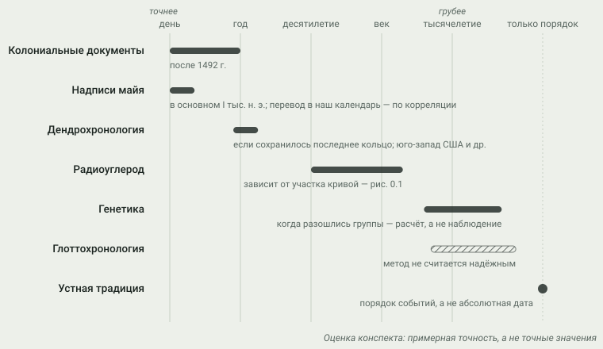

# 0. Как это знают: источники и их пределы

> **Статус:** черновик. Сноски ведут на издания из [библиографии](../sources/BIBLIOGRAPHY.md),
> но утверждения ещё не сверены с текстами самих источников. До сверки глава остаётся черновиком.

Почти всё, о чём пойдёт речь до XVI в., происходило без письменности или с
письменностью, которую мы читаем лишь частично. Поэтому первый вопрос не
«что было», а «откуда это известно и с какой точностью». Ответ дают пять
независимых каналов: археология, историческая лингвистика, палеогенетика,
устная традиция и письменные источники. Каждый измеряет свой объект в своих
единицах и со своей погрешностью.

Удобная аналогия — журналы разных подсистем, у каждой из которых свои часы.
Свести журналы можно, но только если знаешь, что пишет каждый и насколько
отстают его часы. Самая частая ошибка — молча считать, что записи из разных
журналов говорят об одном и том же событии. В истории доколумбовой Америки эта
ошибка выглядит так: археологическую культуру отождествляют с народом, народ —
с языковой семьёй, а языковую семью — с генетической популяцией.

## Археология: вещи, а не люди

Археология изучает материальные остатки: орудия, керамику, жилища, погребения,
следы хозяйства. Её основная единица — **археологическая культура**, устойчивый
набор сходных находок на определённой территории в определённое время.
Культура Кловис — это тип желобчатого наконечника и связанный с ним набор
находок. На каком языке говорили его изготовители и как они себя называли,
археология сказать не может. Одну культуру могли оставить носители разных
языков, а один народ за свою историю мог сменить несколько культур. Поэтому в
[графе родословной](https://wesaix.github.io/abya-yala/visuals/genealogy/)
культура — отдельный тип узла, и связи между культурой и народом там чаще
пунктирные, чем сплошные.

### Радиоуглерод: почему у древних дат знак «≈»

Пока организм жив, он получает углерод из атмосферы, в том числе
радиоактивный изотоп ¹⁴C. После смерти обмен прекращается, и ¹⁴C распадается
с периодом полураспада около 5700 лет. По остатку изотопа в образце
вычисляют **радиоуглеродный возраст**. Это ещё не календарная дата: содержание
¹⁴C в атмосфере менялось, поэтому радиоуглеродный возраст переводят в
календарный по **калибровочной кривой**. Её строят по материалам с известным
возрастом, прежде всего по годичным кольцам деревьев. Для Северного полушария
действует кривая IntCal20,[^reimer2020] для Южного — SHCal20,[^hogg2020] и для
дат из Южной Америки это различие существенно. Калиброванные даты часто
записывают как *cal BP* — календарные годы до 1950 г.

Калибровочная кривая не прямая. На крутых участках погрешность измерения
превращается в узкий календарный интервал. На «плато» и извилинах та же
погрешность даёт широкий интервал или несколько несвязанных интервалов
(рис. 0.1). Поэтому радиоуглеродная дата — это диапазон с вероятностями, а не
год, и поэтому все даты до 1500 г. в конспекте показаны приблизительными.

<picture>
  <source media="(prefers-color-scheme: dark)" srcset="img/00-radiocarbon-dark.svg">
  
</picture>

**Рис. 0.1.** Как одна и та же погрешность измерения даёт разную календарную
точность. *Схема:* кривая условная, это не IntCal20 и не SHCal20.

### Дендрохронология: даты до года — там, где сохранилось дерево

На засушливом юго-западе США деревянные балки в постройках сохранились
веками. Рисунок годичных колец позволяет установить год рубки дерева с
точностью до года. Так датированы постройки Чако-Каньона и Меса-Верде.[^nash1999]
Это год рубки, а не обязательно год постройки, но разница обычно невелика.
Вне засушливых районов дерево, как правило, не сохраняется, и такой точности
нет.

## Лингвистика: языки, а не народы

Историческая лингвистика сравнивает языки и ищет **регулярные звуковые
соответствия**. Если они найдены, родство языков доказано и можно
реконструировать праязык: его звуки, часть словаря, порядок распада семьи на
ветви.[^campbell1997] Это даёт *относительную* хронологию: какая ветвь
отделилась раньше. Абсолютные даты лингвистика даёт плохо. Глоттохронология
предполагала, что базовая лексика утрачивается с постоянной скоростью, но это
предположение не подтвердилось, и метод не считается надёжным.[^campbell1997]

Язык и его носители перемещаются независимо. Язык может распространиться без
смены населения — как язык торговли, власти или религии. Кечуа старше
государства инков; инки сделали его языком управления, и он распространился
далеко за пределы родины.[^daltroy2002] Если бы мы судили о миграциях только
по картам языков, мы увидели бы переселение там, где его не было.

Предположения о дальнем родстве остаются гипотезами, пока не найдены
регулярные соответствия, которые принимают другие лингвисты. Пример —
дене-енисейская гипотеза о родстве языков на-дене с кетским языком на
Енисее.[^vajda2010] В конспекте такие связи помечаются как гипотезы.

## Генетика: популяции, а не самосознание

Древняя ДНК показывает, кто кому родственник, где смешивались группы и когда
примерно они разошлись. Геном младенца со стоянки Апвард-Сан-Ривер на Аляске
(около 11,5 тыс. лет назад) выявил отдельную популяцию «древних берингийцев»,
отделившуюся от предков остальных коренных американцев.[^morenomayar2018]
Время такого расхождения — модельная оценка: оно зависит от принятой
скорости мутаций и демографических допущений, и его погрешность — тысячелетия.

Чего генетика не показывает: язык, культуру и то, кем люди себя считали.
Генетическая близость не делает группы одним народом, а генетическое различие
не делает их разными.

У этого канала есть и вопрос, который не решается в лаборатории: кто вправе
распоряжаться останками предков. Скелет, найденный в 1996 г. у Кенневика
(штат Вашингтон), стал предметом многолетнего спора учёных и племён. Геном,
опубликованный в 2015 г., оказался ближе всего к геномам современных
коренных американцев.[^rasmussen2015] В США возвращение останков и
священных предметов общинам регулирует закон NAGPRA 1990 г.[^cohen2012]
Для конспекта отсюда простое правило: генетические данные используются, но
не как довод о чьей-то идентичности.

## Устная традиция: память со своей логикой

Предания передаются поколениями и при каждом пересказе отчасти
переосмысляются. Это не магнитофонная запись, но и не вымысел. Вансина
показал, что с устной традицией можно работать как с источником, если
учитывать её правила: кто рассказывает, зачем, в каком жанре, какие тексты
передаются дословно, а какие свободно.[^vansina1985] Есть две симметричные
ошибки: отбросить предание как миф или принять его буквально как хронику.

Иногда устная традиция и археология сходятся. В преданиях инуитов
говорится о *тунит* — прежних обитателях Арктики, живших там до предков
инуитов. Археологи обычно связывают их с палеоэскимосской культурой
дорсет.[^hnai-v05]

> [!NOTE]
> **Оценка.** Отождествление тунит с дорсетом широко принято, но это
> сопоставление двух каналов, а не доказательство одним из них.
> Эхо-Хок предлагал систематически сводить устные традиции с археологией
> даже для очень древних событий;[^echohawk2000] насколько далеко в прошлое
> это работает, спорно.

Абсолютных дат устная традиция почти не даёт. Её сила — в порядке событий и
в том, что она сообщает, как сами люди понимали своё прошлое. Ни один другой
канал этого не показывает.

## Письменные источники: две очень разные группы

**Собственная письменность Мезоамерики.** Иероглифическое письмо майя
сочетает знаки-слова и знаки-слоги. Его дешифровка во многом выросла из
фонетического подхода Кнорозова.[^knorozov1963] Надписи на памятниках
классического периода (примерно III–IX вв.) называют имена правителей,
войны, союзы и даты в «долгом счёте» — с точностью до дня.[^martin2008]
Чтобы перевести их в наш календарь, нужна корреляция двух календарей.
Принятая корреляция независимо подтверждена радиоуглеродным датированием
резных деревянных перемычек из Тикаля, на которых есть даты.[^kennett2013] Это главное
исключение из правила «до 1500 г. — приблизительно».

**Колониальные документы.** С 1492 г. появляются тексты с точными датами, но
пишут их почти всегда посторонние: конкистадоры, миссионеры, чиновники,
торговцы. Отсюда три постоянных искажения:

- **Чужие имена.** Народы известны под экзонимами, часто полученными через
  соседей (подробнее — в [глоссарии](../glossary.md)).
- **Числа с интересом.** Потери, численность войск и население завышали,
  чтобы оправдать или прославить, и занижали, чтобы скрыть.
- **Чужие категории.** Верховных вождей называли «королями», конфедерации —
  «империями», союзы — подданством.

Есть и колониальные тексты, созданные самими коренными авторами или при их
решающем участии. Это андская хроника Гуамана Помы с сотнями рисунков[^guamanpoma1615]
и «Флорентийский кодекс», составленный Саагуном вместе с информантами и
писцами-науа.[^sahagun1577] Они тоже написаны в колониальной ситуации, но
показывают события изнутри.

## Как сводить каналы

Каналы различаются не только объектом, но и точностью, причём на порядки
(рис. 0.2).

<picture>
  <source media="(prefers-color-scheme: dark)" srcset="img/00-precision-dark.svg">
  
</picture>

**Рис. 0.2.** Типичная точность датировки по каналам. *Оценка конспекта:*
порядок величин, а не измеренные значения.

Каналы отвечают и на разные вопросы. Таблица ниже — тоже оценка: она
показывает, на что можно опираться, а где нужен второй канал.

| Вопрос | Археология | Лингвистика | Генетика | Устная традиция | Письменные |
|---|:-:|:-:|:-:|:-:|:-:|
| Когда? (абсолютная дата) | ● | — | ◐ | — | ● |
| Кто чей потомок? | ◐ | — | ● | ◐ | — |
| Какие языки родственны? | — | ● | — | — | ◐ |
| Как люди себя называли и понимали? | — | ◐ | — | ● | ◐ |
| Как жили и чем кормились? | ● | ◐ | — | ◐ | ◐ |
| Сколько их было? | ◐ | — | ◐ | — | ◐ |

● — канал отвечает прямо; ◐ — частично или косвенно; — — не отвечает.

Отсюда рабочие правила конспекта:

1. **Утверждение помечается каналом, из которого оно пришло.** «Культура
   туле распространилась до Гренландии» — археология. «Инуиты — потомки
   туле» — вывод из нескольких каналов.
2. **Отождествление между каналами — гипотеза, пока его не подтверждают
   независимо.** «Эта культура — предки этого народа» требует хотя бы двух
   каналов, которые согласуются.
3. **Согласие независимых каналов сильнее любого одного из них.** Расселение
   туле видно и в археологии, и в генетике,[^raghavan2014] и в преданиях о тунит — поэтому
   этой картине можно доверять больше, чем любой из её частей по
   отдельности.
4. **Точность не переносится между каналами.** Дата надписи майя точна до
   дня; дата культуры, к которой отнесли находку рядом, — нет.

### Соглашения о датах и связях

- Все даты — календарные; «до н. э.» в данных — отрицательный год.
  Радиоуглеродные даты приводятся только калиброванными.
- Даты до 1500 г. по умолчанию приблизительны. Точная дата допустима,
  только если она взята из датированной надписи или из дендрохронологии и
  это указано в источнике записи.
- В данных точность даты хранится явно: `documented`, `approx`,
  `conventional` (условная дата для схемы). Надёжность связи:
  `established`, `probable`, `hypothesis` — то же разделение, что «факт /
  оценка / гипотеза» в текстах.

## Вывод

История доколумбовой Америки — реконструкция по измерениям в несовместимых
единицах. Археология видит вещи, лингвистика — языки, генетика — популяции,
устная традиция — память, письменные источники — взгляд автора, чаще всего
постороннего. Точность каналов различается от дня до тысячелетий. Сила
реконструкции — в согласии независимых каналов, а главная опасность — в
молчаливом отождествлении их объектов. Поэтому дальше в конспекте у каждого
утверждения видно, откуда оно и насколько оно надёжно.

Следующая глава — заселение Америки. Там работают все каналы сразу и там же
видно, как они расходятся: спор о стоянках старше Кловиса — это спор о
том, чему верить, когда археология опережает генетику.

## Источники

[^reimer2020]: Reimer et al. 2020 — IntCal20.
[^hogg2020]: Hogg et al. 2020 — SHCal20.
[^nash1999]: Nash 1999.
[^campbell1997]: Campbell 1997.
[^daltroy2002]: D'Altroy 2002.
[^vajda2010]: Vajda 2010.
[^morenomayar2018]: Moreno-Mayar et al. 2018.
[^rasmussen2015]: Rasmussen et al. 2015.
[^cohen2012]: Cohen's Handbook of Federal Indian Law, 2012.
[^vansina1985]: Vansina 1985.
[^hnai-v05]: Handbook of North American Indians, vol. 5: Arctic (Damas, ред., 1984).
[^echohawk2000]: Echo-Hawk 2000.
[^knorozov1963]: Кнорозов 1963.
[^martin2008]: Martin & Grube 2008.
[^kennett2013]: Kennett et al. 2013.
[^raghavan2014]: Raghavan et al. 2014.
[^guamanpoma1615]: Guaman Poma de Ayala, ок. 1615.
[^sahagun1577]: Sahagún, ок. 1577.
