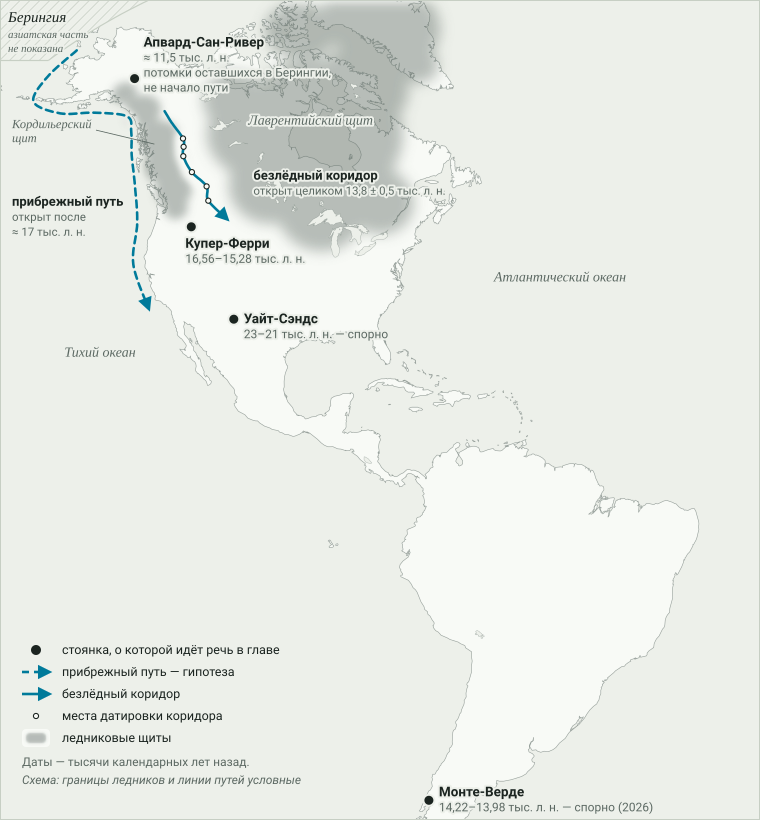
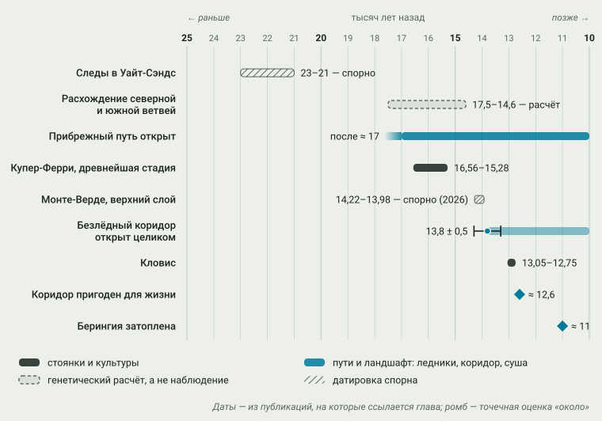
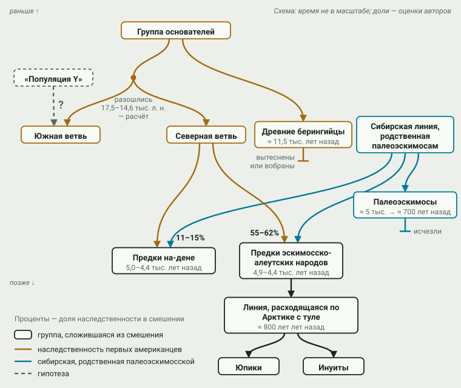

# 1. Заселение: Берингия и волны миграций

> **Статус:** принято. Глава прошла рецензию и сверку источников; вердикт по
> каждой сноске — в [журнале сверки](../sources/audits/01-zaselenie.json).

Люди пришли в Америку из Северной Азии через район нынешнего Берингова
пролива — в этом исследователи в целом согласны, а древняя ДНК это
подтвердила.[^morenomayar2018][^hoffecker2023] Спор идёт о другом:
когда это случилось, каким путём люди прошли на юг мимо ледников и сколько
было приходов. Опорный тезис конспекта № 1 отвечает на последний вопрос так:
заселение шло несколькими волнами — [палеоиндейцы](../glossary.md#периоды),
позже палеоэскимосы, неоэскимосы и на-дене (народы, говорящие на языках этой
семьи, — от Аляски почти до Гудзонова залива и на юге до реки
Рио-Гранде).[^uafdene] Эта глава проверяет тезис на свидетельствах, о которых
шла речь в [главе 0](00-metodika.md), и это первое их применение: здесь
видно, как датировки, ледниковая геология и древняя ДНК то спорят, то
подтверждают друг друга.

У коренных народов есть и собственные предания о происхождении: Роджер
Эхо-Хок, например, разбирал предание арикара, в котором видел рассказ об
истории людей в Новом Свете от первого заселения.[^echohawk2000] Эта глава
отвечает на другой вопрос — что о заселении говорят находки, геология и
ДНК; как обращаться с преданием как с источником, разобрано в
[гл. 0](00-metodika.md#устная-традиция-память-со-своей-логикой).

Короткий итог проверки: первая часть тезиса держится, а вторая требует
поправки. Предки почти всех коренных народов обеих Америк восходят к одной
группе основателей, которая потом разделилась на ветви. Палеоэскимосы
действительно пришли из Азии позже и отдельно. Предки на-дене и предки
эскимосско-алеутских народов, к которым относятся и инуиты, по данным
2019 г., — потомки смешения уже живших в Америке людей с пришельцами из
Сибири, родственными палеоэскимосам.[^flegontov2019]

> [!NOTE]
> **Оценка конспекта.** Сами Флегонтов и соавторы описывают это как
> несколько переселений из Азии: нынешние коренные американцы, по их словам,
> восходят не менее чем к четырём потокам древних переселений, и линия
> «неоэскимосов», распространившаяся с культурой туле, — один из
> них.[^flegontov2019] Поправка к тезису — оценка конспекта, а не вывод
> источника: конспект подчёркивает в этих поздних приходах не отдельность, а
> смешение с теми, кто уже жил в Америке.

## Берингия: не мост, а край

Во время последнего оледенения столько воды было связано во льду, что
уровень океана опустился: в начале
[последнего ледникового максимума](../glossary.md#последний-ледниковый-максимум),
около 26,5 тыс. лет назад, он был ниже нынешнего не менее чем на 120 м.[^hoffecker2023]
Обнажились широкие участки морского дна между Чукоткой и Аляской — это и есть
[Берингия](../glossary.md#берингия) — и ещё более обширная равнина вдоль
арктического берега Сибири, которая большей частью лежит уже за пределами
Берингии в принятых её границах.[^hoffecker2023]
Привычное выражение «сухопутный мост» здесь обманывает: это был не узкий
перешеек, а целый край. Сибирская равнина, на месте нынешнего
арктического шельфа Восточной Сибири, была сухой степью-тундрой с
разнообразными крупными животными, а суша между Чукоткой и Аляской —
сырой тундрой, где крупных животных, вероятно, было меньше.[^hoffecker2023] Сушу
между материками окончательно затопило только около 11 тыс. лет
назад.[^hoffecker2023] Путь из Азии в Америку, таким образом, был открыт
долго. Закрыт был путь дальше: ледниковые щиты Северной Америки
перекрывали дорогу на юг, и Хоффекер с соавторами считают их
расположение главным условием, от которого зависело заселение.[^hoffecker2023]

Отсюда вопрос, на который отвечает в основном генетика: ждали ли люди у
края льда? По расчёту Морено-Майяра и соавторов (2018), предки коренных
американцев начали отделяться от предков жителей Восточной Азии около
36 тыс. лет назад, но обмен браками между ними продолжался примерно до
25 тыс. лет назад; после этого предки американцев жили обособленно.[^morenomayar2018]
Такую обособленность называют
[«берингийской остановкой»](../glossary.md#берингийская-остановка): название
и обоснование по митохондриальной ДНК, которая передаётся по материнской
линии, дали Тамм и соавторы в 2007 г.[^hoffecker2023][^tamm2007] Сама мысль,
что предки американцев долго жили в Берингии, прежде чем двинуться дальше,
высказывалась и раньше, в 1990-е.[^tamm2007][^bonatto1997] Длительность
изоляции оценивают по-разному: по геномам 2015 г. — не более 8000
лет,[^raghavan2015] по Y-хромосоме (участку ДНК, который передаётся только от
отца к сыну) — не более 2,7 или 4,6 тыс. лет, в зависимости от того, какой
сценарий истории этой группы принять.[^pinotti2019] Разброс не
случаен: это не наблюдение, а расчёт, зависящий от того, как быстро, по
оценкам, меняется ДНК (см. [гл. 0](00-metodika.md#генетика-родство-а-не-самосознание)).

Где именно жила обособленная группа, ДНК не говорит. Морено-Майяр и
соавторы оставили два варианта — Северо-Восточная Азия или сама Берингия — и
отметили, что археологии лучше соответствует первый: надёжно датированные
стоянки Берингии не старше 15–14 тыс. лет.[^morenomayar2018]

> [!NOTE]
> **Оценка.** Хоффекер и соавторы (2023) считают само слово «остановка»
> неудачным: по их мнению, предки американцев во время ледникового максимума
> не прятались в убежище, а расселились по огромной арктической равнине, а
> затем освоили южный, приморский край Берингии.[^hoffecker2023] Они же
> признают, что археологических следов людей на южной, ныне затопленной
> части Берингии нет.[^hoffecker2023] Это вывод из генетики и
> палеогеографии, а не из находок.

## «Кловис первыми»: как проверяли даты

Долгое время в американской археологии держалась простая схема. Самые
древние бесспорные следы людей — [археологическая
культура](../glossary.md#археологическая-культура) Кловис с её желобчатыми
наконечниками,[^waters2007] о которой шла речь в [главе 0](00-metodika.md#археология-вещи-а-не-люди).
Значит, её носители и были первыми, а пришли они с севера по коридору между
тающими ледниками.[^clark2022] Эту схему так и называют — «Кловис
первыми» (англ. *Clovis First*). По сводке Уотерса и соавторов (2020),
32 радиоуглеродные даты с 10 стоянок помещают Кловис примерно в
13 050–12 750 лет назад.[^waters2020] Ещё в 2007 г. те же исследователи
показали, что эта технология возникла и распространилась по Северной Америке,
возможно, всего за 200 лет, а её возраст совпадает с возрастом стоянок
других культур в обеих Америках.[^waters2007] Отсюда они заключили, что люди жили в
Америке и до Кловиса.[^waters2007] Сводка 2020 г. добавила, что наконечники
с черешком (выступом у основания, которым наконечник крепили к древку) на
западе Северной Америки одновременны Кловису и даже старше его,
а на юге Южной Америки около 12 900 лет назад уже была своя традиция
наконечников «рыбий хвост».[^waters2020]

Решающим доводом тогда стала не сводка, а одна стоянка — Монте-Верде на юге
Чили, которую исследует Том Диллехей с коллегами. Морские водоросли из
очагов её верхнего слоя датированы напрямую: 14 220–13 980 календарных лет
назад.[^dillehay2008] Это примерно на тысячу лет старше Кловиса и далеко к
югу от ледников. Спор о Монте-Верде — тот самый, о котором
предупреждала [глава 0](00-metodika.md#вывод): верны ли даты, точно ли
находки связаны со слоем, по которому их датировали, и оставлены ли они
людьми вообще. Тогда его, как казалось, закрыли — и необычным
способом. В январе 1997 г. группа специалистов по
древнейшим американцам осмотрела коллекции и сам раскоп и пришла к
согласию: верхний слой оставлен людьми, и его возраст — около
12 500 лет.[^meltzer1997] (Судя по прямым датам водорослей из того же слоя —
около 12 300 радиоуглеродных лет,[^dillehay2008] — это возраст в
радиоуглеродных годах; в календарных он больше.)
Нижний слой, для которого предлагали около 33 тыс. лет, группа признала
нерешённым вопросом.[^meltzer1997] В 2015 г. Диллехей и соавторы описали на
том же участке возможные следы людей возрастом примерно от 18,5 до
14,5 тыс. лет,[^dillehay2015] но это пока именно возможные следы, а не
согласие специалистов.

В 2026 г. спор о Монте-Верде открылся снова. В марте Тодд Суровелл и
соавторы опубликовали в журнале Science, по их словам, первое независимое
исследование стоянки почти за 50 лет.[^surovell2026] Они изучили и
датировали девять обнажений речных отложений по берегам ручья Чинчиуапи, у
которого лежит стоянка.[^uwyo2026] Главный их довод — слой
[тефры](../glossary.md#тефра), вулканического пепла, возрастом около
11 тыс. лет, который, по их выводу, залегает ниже слоя с находками.[^surovell2026]
Древесина ледниковой эпохи, по их мнению, попала в этот слой из более
древних отложений, поэтому по ней нельзя датировать пребывание людей,[^uwyo2026]
а находки в целом лежат не на своём первоначальном месте.[^waters2026]
Отсюда вывод: стоянка не старше среднего [голоцена](../glossary.md#голоцен)
(так называют время после оледенения; средний голоцен — 8200–4200 лет
назад).[^surovell2026]

Ответы вышли сначала откликами на сайте Science (май 2026 г.), затем
рецензируемыми статьями в журнале PaleoAmerica (август 2026 г.). Диллехей и
соавторы указывают, что Суровелл и коллеги не вели раскопок на месте самой
стоянки и сопоставили с её слоями обнажения, которые лежат в стороне и на
несколько метров выше; что слой находок прямо перекрыт торфом, надёжно
датированным примерно 14,5 тыс. лет назад; и что из трёх слоёв, принятых за
тефру, один, по их анализу, — грибковый слой, другой — слой вулканических
гранул, богатых оксидами железа, а третий вряд ли соответствует пеплу
возрастом 11 тыс. лет.[^dillehay2026b] Уотерс и
соавторы добавляют, что две [люминесцентные](../glossary.md#люминесцентное-датирование)
даты (они показывают, когда песок последний раз видел свет, то есть когда
его засыпало), полученные самими Суровеллом и соавторами для речных песков
в основании террасы, к которой относится стоянка, — около 18,1 и 14,3 тыс.
лет — говорят о том, что поверхность, на которой лежат находки, существовала
уже в конце ледниковой эпохи.[^waters2026b][^dillehay2026b] Обе группы
заключают, что прежний возраст, около 14,5 тыс. лет, новое исследование не
опровергает;[^dillehay2026][^waters2026] Суровелл и соавторы, в свою очередь,
ответили на критику, не отказавшись от своего вывода.[^dillehay2026]

После 1997 г. вопрос «был ли кто-то до Кловиса» сменился вопросом
«насколько раньше». Современный пример — отпечатки человеческих
ступней в национальном парке Уайт-Сэндс (штат Нью-Мексико). В 2021 г.
Беннетт и соавторы датировали их по семенам водного растения в слоях над
и под отпечатками: около 23–21 тыс. лет назад, то есть в разгар ледникового
максимума.[^bennett2021] Критики сразу указали на слабое место: водные растения
могут брать «старый» углерод из воды, и тогда даты выходят на тысячи лет
древнее истинных ([резервуарный эффект](../glossary.md#резервуарный-эффект)).[^madsen2022]
В 2023 г. авторы находки датировали тот же слой двумя другими способами —
по пыльце наземных растений и по осадку самого слоя, — и получили тот же
возраст.[^pigati2023] Критики ответили, что и эти даты могут быть завышены:
пыльца могла быть переотложена из более старых слоёв, а образцы осадка
взяты ниже большинства отпечатков.[^rhode2024] В 2025 г. вышла ещё одна
серия — 26 радиоуглеродных дат по отложениям древнего озера Отеро, которые
прослеживаются до слоя с отпечатками; даты получены в двух лабораториях, не
участвовавших в прежних датировках.[^holliday2025] Правда, пять из этих дат —
снова по семенам водного растения, то есть по тому материалу, который
критиковали.[^holliday2025] Серия в целом снова поддержала возраст
ледникового максимума.[^holliday2025] Но среди
авторов этой работы — один из соавторов статьи 2021 г.,[^holliday2025][^bennett2021]
так что независимы лаборатории, а не исследовательская группа.

> [!NOTE]
> **Оценка конспекта.** На осень 2026 г. возраст Уайт-Сэндс — около
> 23–21 тыс. лет — поддержан несколькими независимыми методами, но не принят
> всеми: последняя известная конспекту критическая работа вышла в 2024 г.,
> последний ответ на неё — в 2025-м.[^rhode2024][^holliday2025] С 2026 г.
> оспорен и возраст Монте-Верде, так что обе самые известные стоянки старше
> Кловиса теперь спорны. На октябрь 2026 г. спор о Монте-Верде не решён.
> Защитники стоянки — не один
> лагерь: среди них и Холлидей, отстаивающий возраст Уайт-Сэндс, и Мэдсен и
> Дэвис, критиковавшие его;[^dillehay2026][^waters2026][^madsen2022] Холлидей
> и Дэвис подписали обе ответные статьи.[^dillehay2026][^waters2026] Решат
> спор, скорее всего, не подписи, а новые полевые работы на самой стоянке.
>
> Вывод «люди были к югу от ледников раньше Кловиса» держится при этом и
> без Монте-Верде: во-первых, на группе стоянок Северной Америки
> возрастом примерно 16–14,5 тыс. лет,[^hoffecker2023][^clark2022] прежде
> всего на Купер-Ферри на западе штата Айдахо, где, по данным 2019 г., люди
> бывали уже 16 560–15 280 лет назад.[^davis2019] Во-вторых, на генетике,
> которая от археологии не зависит:[^meltzer2026] по расчёту 2018 г., северная
> и южная ветви коренных американцев разошлись 17,5–14,6 тыс. лет назад,
> вероятно, уже к югу от ледников.[^morenomayar2018] Ту же мерку, что к
> Уайт-Сэндс, стоит приложить и здесь: Дэвис и Мэдсен, защищающие Монте-Верде, — соавторы
> работы о Купер-Ферри.[^davis2019] А Суровелл считает, что новая хронология
> говорит за более позднее появление людей в Америке,[^uwyo2026] и в интервью 2026 г.
> назвал другие предложенные стоянки старше Кловиса «не слишком
> убедительными».[^metcalfe2026] Большинство авторов, на которых опирается
> глава, с ним не согласны, но довод о Купер-Ферри и других стоянках этой
> группы — тоже текущая позиция, а не окончательный ответ.
>
> Если возраст Уайт-Сэндс подтвердится, люди были к югу от ледников уже во
> время ледникового максимума — то есть тогда, когда, по генетическим
> расчётам, предки нынешних коренных американцев ещё жили обособленно где-то
> на севере. Как совместить одно с другим, источники главы не решают.

Спор о Кловисе и Монте-Верде показывает рабочее правило главы 0 в действии:
одна дата, даже точная, ничего не решает, пока не доказана связь находки со
слоем. Решают серии дат разными методами и проверка стоянки другими людьми.
Спор 2026 г. — то же правило вживую. Суровелл и соавторы оспаривают как раз
связь дат со слоем находок: по их мнению, датировали древесину, а не
пребывание людей. Их оппоненты отвечают тем же доводом с другой стороны:
пробы Суровелла, по их мнению, взяты не из слоёв самой стоянки. Это и есть
проверка другими людьми — первая полевая за почти 50 лет, по словам её
авторов,[^surovell2026] — и чем она кончится, пока не ясно.

## Путь на юг: побережье или коридор

Модель «Кловис первыми» держалась на дороге: между Кордильерским ледниковым
щитом на западе и Лаврентийским на востоке, по мере таяния, открывался
[безлёдный коридор](../glossary.md#безлёдный-коридор) вдоль восточного края
Скалистых гор.[^clark2022] Его длину оценивают по-разному: около
1500 км[^pedersen2016] или примерно 2000 км — от Юкона до юга
Альберты;[^hoffecker2023] геологи, датировавшие его открытие, брали пробы
вдоль полосы длиной около 1200 км.[^clark2022] Но для
пути нужен не только свободный ото льда, но и пригодный для жизни коридор.
Здесь сошлись два новых вида данных. Геологи датировали камни, освободившиеся
из-подо льда, и по ним коридор целиком открылся около 13,8 ± 0,5 тыс. лет
назад.[^clark2022] Другая группа изучила осадки озёр в самом узком месте
коридора, включая ДНК растений и животных, сохранившуюся в иле: степь,
бизоны и мамонты появились там около 12,6 тыс. лет назад.[^pedersen2016]
А заселение, судя по археологии и древней ДНК, началось раньше: Кларк и
соавторы относят его ко времени до 15,6 тыс. лет назад — по датам стоянки
Купер-Ферри и генетическим расчётам — и заключают, что коридор для этого был
ещё закрыт.[^clark2022] Первые люди к югу от ледников,
скорее всего, пришли не этим путём; более поздние группы могли им
пользоваться.[^pedersen2016]

Остаётся побережье Тихого океана. На юго-востоке Аляски, в самом узком месте
возможного приморского пути, ледник был наибольшим около 20–17 тыс. лет
назад, а после 17 тыс. лет назад путь стал открыт, и на освободившемся берегу
почти сразу сложились богатые морские и наземные сообщества растений и
животных.[^lesnek2018] Это делает прибрежный путь возможным. Доказать, что
люди им прошли, гораздо труднее: часть тогдашнего берега, вероятно, лежала
на шельфе, который теперь под водой,[^lesnek2018] а самые древние следы людей
на северо-западном побережье пока датируются около 13 тыс. лет
назад.[^hoffecker2023]

> [!IMPORTANT]
> **Гипотеза.** Первые люди прошли на юг вдоль тихоокеанского побережья,
> вероятно, отчасти на лодках. Её поддерживают и геологи, датировавшие
> коридор, и авторы обзора 2023 г.: коридор открылся слишком поздно, а
> побережье освободилось раньше.[^clark2022][^hoffecker2023] Её же поддержали
> в 2019 г. исследователи Купер-Ферри: стоянка старше открытия
> коридора.[^davis2019] Но опирается
> она на исключение альтернативы и на геологию, а не на находки самих
> стоянок на древнем берегу. Кларк и соавторы отмечают, что убедительных
> археологических свидетельств первого прохода через коридор тоже
> нет.[^clark2022]
>
> В 2026 г. Суровелл и соавторы, опираясь на новую дату Монте-Верде,
> заключили, что первый проход внутрь материка — то есть по коридору — снова
> стоит считать возможным.[^uwyo2026][^meltzer2026] Археолог Дэвид Мельтцер и
> генетики, среди которых авторы генетических работ этой главы, возразили:
> возраст стоянки в Чили никак не влияет на то, когда отступали ледники за
> 10 тыс. км к северу, а о коридоре надо судить по геологическим и
> генетическим данным из него самого;[^meltzer2026] эти данные приведены
> выше.

<picture>
  <source media="(prefers-color-scheme: dark)" srcset="img/01-routes-dark.svg">
  
</picture>

**Рис. 1.1.** Два возможных пути на юг и стоянки, о которых идёт речь в
главе; пометка «спорно» — возраст стоянки оспорен, в скобках — год, с
которого. *Схема:* стрелки и границы ледников условные; даты открытия путей —
по Lesnek et al. 2018 и Clark et al. 2022, координаты стоянок — по
публикациям раскопок (у Купер-Ферри — приблизительно).

Даты, на которых держится весь спор, удобнее увидеть рядом (рис. 1.2).
Главное в них — порядок. Люди в Купер-Ферри жили по меньшей мере на тысячу
лет раньше, чем коридор открылся целиком, — значит, к югу от ледников они
попали, когда сквозного пути внутри материка ещё не было. Монте-Верде, если
её прежний возраст верен, говорит о том же. Кловис моложе и Купер-Ферри, и
открытия коридора. Расхождение северной и южной ветвей коренных американцев
по генетическому расчёту приходится примерно на то же время, когда
освободилось побережье, или позже.

<picture>
  <source media="(prefers-color-scheme: dark)" srcset="img/01-timeline-dark.svg">
  
</picture>

**Рис. 1.2.** Последовательность событий заселения. *Данные и оценки:*
археологические и геологические даты — из публикаций, указанных в тексте;
генетическое расхождение — расчёт, а не наблюдение, и показано иначе;
штриховкой — оспоренные датировки (Уайт-Сэндс и, с 2026 г.,
Монте-Верде).

## Что говорит ДНК: одна основа, много ветвей

К 2018 г. единственными известными останками людей ледникового времени на
Аляске были останки двух младенцев со стоянки Апвард-Сан-Ривер (около
11,5 тыс. лет назад); геном одного из них упоминался в
[главе 0](00-metodika.md#генетика-родство-а-не-самосознание).[^morenomayar2018]
Раскопки и изучение этих останков шли по соглашению, которое вместе со штатом
Аляска и Национальным научным фондом США подписали совет племени Хили-Лейк и
Конференция вождей танана — организации коренных жителей
Аляски.[^morenomayar2018]
Морено-Майяр и соавторы назвали эту группу «древними берингийцами» и
показали, что она и предки всех остальных коренных американцев восходят к
одной группе основателей. Остальные коренные американцы делятся на две
основные ветви, северную и южную; они разошлись около 17,5–14,6 тыс. лет
назад, вероятно, уже к югу от ледников.[^morenomayar2018] Нынешние северные
[индейские](../glossary.md#индейцы-коренные-народы) народы Аляски, по
предположению тех же авторов, — потомки людей северной ветви, которые после
11,5 тыс. лет назад, вероятно, вернулись на север и вытеснили или вобрали
древних берингийцев.[^morenomayar2018]

Обзор Виллерслева и Мельтцера (2021) подводит итог десятилетию работы с
древними геномами: все древние люди Америки, кроме поздних пришельцев в
Арктику, ближе к нынешним коренным американцам, чем к любому другому
населению мира.[^willerslev2021] Это ставит под сомнение старое
предположение, сделанное по анатомии древних скелетов, что до предков
индейцев в Америке жило какое-то иное население.[^willerslev2021] Одно место
остаётся неясным. У части народов Амазонии и у одного народа Центрального
Бразильского плоскогорья генетики нашли небольшую примесь — по их расчёту,
1–2% наследственности, — которая ближе к коренным
жителям Австралии, Новой Гвинеи и Андаманских островов, чем к любому
населению Евразии или Америки; в Северной и Центральной Америке её нет или
она слабее.[^skoglund2015]

> [!IMPORTANT]
> **Гипотеза.** Скоглунд и соавторы (2015) объясняют эту примесь ещё одной
> группой основателей Америки.[^skoglund2015] В генетической литературе её
> называют «популяцией Y».[^flegontov2019] Как и
> когда эта наследственность попала в Амазонию, по источникам главы не
> установлено.

Для тезиса отсюда важно вот что. Первая «волна» — не одна толпа, перешедшая
из Азии разом, а одна группа основателей, которая какое-то время жила
обособленно (по оценке 2007 г. — до 15 тыс. лет, по более поздней, 2019 г., —
не дольше 4,6 тыс.), а затем, по расчётам генетиков, быстро расселилась на
юг и разделилась на ветви.[^tamm2007][^pinotti2019] Это
согласуется с тезисом о «палеоиндейцах» как первом приходе, но слово
«волна» здесь обозначает происхождение, а не одно событие.

## Арктика: поздние приходы и смешения

Через несколько тысячелетий после того, как Берингию затопило, из Азии в
Америку снова пришли люди. Здесь и проверяется вторая половина тезиса.

**Палеоэскимосы.** По геномам 2014 г.,
[палеоэскимосы](../glossary.md#палеоэскимосы-и-неоэскимосы), жившие в
Арктике примерно с 3000 г. до н. э. до 1300 г. н. э., — отдельный приход из
Азии, не связанный ни с предками индейцев, ни с предками инуитов.[^raghavan2014] Это была,
вероятно, одна группа людей, которая больше 4000 лет прожила почти без
связи с соседями, хотя и покидала временами огромные районы Арктики, и
исчезла около 700 лет назад.[^raghavan2014] Флегонтов и соавторы оговаривают,
что слова «палеоэскимосы» и «неоэскимосы» приняты не всеми учёными и не
всеми коренными народами Канады и США.[^flegontov2019] Палеоэскимосскую
культуру дорсет археологи связывают с *тунит* инуитских преданий — это
сопоставление разобрано в
[гл. 0](00-metodika.md#устная-традиция-память-со-своей-логикой). Почему
палеоэскимосы исчезли, свидетельства этой главы не объясняют. Рагхаван и
соавторы нашли следы давнего обмена генами между палеоэскимосами и предками
инуитов,[^raghavan2014] но Флегонтов и соавторы называют вопрос о таком
смешении нерешённым.[^flegontov2019]

**Туле и предки инуитов.** Культура туле пришла с Аляски в восточную
Арктику Северной Америки, и с этим переселением связана история нынешних
[инуитов](../glossary.md#эскимосы-инуиты-юпики).[^friesen2008] Чаще всего
считалось, что оно началось около 1000 г.[^friesen2008] Фризен и Арнольд получили новые
радиоуглеродные даты для двух ранних стоянок туле на арктическом побережье
Канады — в районе, через который пришельцы с Аляски должны были пройти, — и
показали, что ни одна из них не заселена раньше XIII в.[^friesen2008] Это, по
их выводу, усиливает довод в пользу того, что расселение было позднее и
быстрее, чем думали, а «классическая» туле длилась, возможно, 200 лет или
меньше.[^friesen2008] Генетика согласуется с этой картиной: новая линия
наследственности распространилась по Арктике вместе с туле около 800 лет
назад и сегодня есть у юпиков и инуитов.[^flegontov2019] Но и это не чистая
волна из Азии: по той же модели, предки эскимосско-алеутских народов сами
сложились из смешения (о нём — ниже), а позднее, 1700–2300 лет назад, их
потомки ещё обменивались генами с предками чукотско-камчатских народов в
обе стороны.[^flegontov2019] Итак, туле как культура — позднее расселение с
Аляски на восток; это показывает археология.[^friesen2008] А линию
наследственности, которую разнесли туле, Флегонтов и соавторы считают одним
из потоков переселений из Азии — только потоком уже смешанным.[^flegontov2019]

**На-дене.** Здесь конспект поправляет тезис сильнее всего. Флегонтов и
соавторы (2019) нашли наследственность, родственную палеоэскимосской,
повсеместно у народов, говорящих на языках на-дене и на эскимосско-алеутских
языках. По их выводу, несколько переселений — связанных с происхождением
на-дене, с заселением Алеутских островов и с расселением юпиков и инуитов —
генетически восходят к одному сибирскому источнику, родственному
палеоэскимосам.[^flegontov2019] Атабаски — народы, говорящие на атабаскских
языках, одной из самых больших языковых групп Северной Америки; в части
этих мест (реже на Аляске) вместо «атабаски» теперь говорят «дене» — так или
похоже на многих этих языках звучит слово «человек».[^uafdene] По модели Флегонтова и
соавторов, около 4400–5000 лет назад группа,
родственная палеоэскимосам, смешалась с предками атабасков, и её доля в их
наследственности составила 11–15%.[^flegontov2019] У нынешних носителей
языков на-дене эта доля, по одному из методов, — 5–23%, а у троих древних
атабасков, живших 900–550 лет назад, — 32–43%.[^flegontov2019] Авторы
объясняют снижение тем, что атабаски продолжали вступать в браки с
соседними индейскими народами.[^flegontov2019] Место смешения ДНК не
указывает; по археологии и из соображений простоты авторы считают самым
вероятным Аляску.[^flegontov2019] Эскимосско-алеутские народы — тоже
результат смешения: по той же модели, люди северной индейской ветви около
4400–4900 лет назад дали их предкам 55–62% наследственности.[^flegontov2019]

Вывод 2019 г. — не единогласное мнение. Годом раньше Морено-Майяр и
соавторы нашли у части северных индейских народов примесь от сибирского
населения, близкого к нынешним корякам, но не к палеоэскимосам.[^morenomayar2018]
Флегонтов и соавторы сравнили свою модель с этой и пришли к выводу, что их
модель описывает данные значительно лучше.[^flegontov2019] Это текущая
позиция, а не окончательный ответ: первоочередной задачей сами авторы
называют изучение древних останков с Аляски того времени, когда, по их
расчёту, шло смешение.[^flegontov2019]

<picture>
  <source media="(prefers-color-scheme: dark)" srcset="img/01-ancestry-dark.svg">
  
</picture>

**Рис. 1.3.** Приходы и смешения по данным палеогенетики. *Схема:* по
моделям Moreno-Mayar et al. 2018 и Flegontov et al. 2019; время по
вертикали не в масштабе, доли наследственности — оценки авторов.

Генетика при этом не говорит, на каком языке говорили люди, смешавшиеся
тогда (правило [гл. 0](00-metodika.md#генетика-родство-а-не-самосознание)).
Связь «наследственность, родственная палеоэскимосской» → «языки на-дене» —
это совпадение двух видов свидетельств, а не одно свидетельство. Отдельный
вопрос — дене-енисейская гипотеза о родстве языков на-дене с кетским языком
Сибири. Она разобрана в
[гл. 0](00-metodika.md#лингвистика-языки-а-не-народы) и остаётся гипотезой;
генетическое [смешение](../glossary.md#генетическое-смешение) её не
доказывает и не опровергает.

Свести проверку тезиса удобнее в таблицу.

| Часть тезиса № 1 | Что показывают источники | Итог |
|---|---|---|
| Через Берингию | Генетика, геология и археология согласны | держится |
| Палеоиндейцы — первая волна | Одна группа основателей, затем ветви; к югу от ледников — примерно 16–14,5 тыс. лет назад (Купер-Ферри и другие стоянки, генетика), возможно — во время ледникового максимума; Монте-Верде с 2026 г. оспорена | держится, с уточнением |
| Палеоэскимосы — позже | Отдельный приход, Арктика примерно с 3000 г. до н. э.; исчезли около 700 лет назад | держится |
| Неоэскимосы — позже | Туле расселились с Аляски на восток не раньше XIII в. (археология); у генетиков линия «неоэскимосов» — один из потоков переселений из Азии, но её предки сами сложились из смешения | держится; оценка конспекта: главное в этом приходе — смешение |
| На-дене — отдельная волна | Смешение северной индейской ветви с пришельцами из Сибири, родственными палеоэскимосам, около 4400–5000 лет назад | оценка конспекта: смешение, а не отдельная волна |

Эти связи можно посмотреть и в [графе
родословной](https://wesaix.github.io/abya-yala/visuals/genealogy/) — в
полосах «Общий корень» и «Арктика».

## Мегафауна: охотники или климат

Конец Кловиса около 12 750 лет назад совпал по времени с исчезновением
последних мамонтов, мастодонтов и других хоботных Северной Америки.[^waters2020]
Всего в конце ледниковой эпохи там вымерли десятки видов крупных
млекопитающих — [мегафауна](../glossary.md#мегафауна).[^broughton2018] Совпадение
по времени ещё не причина, и о причине спорят давно.

> [!IMPORTANT]
> **Гипотеза.** Две работы последних лет пытались проверить это
> сходным приёмом: по числу радиоуглеродных дат судили о том, как
> менялась численность людей и животных. Бротон и Вайтцель (2018) пришли к
> выводу, что причины разнились по видам и районам: в одних случаях
> вымирание связано с охотой, в других — с климатом, в одном — с тем и
> другим.[^broughton2018] Стюарт и соавторы (2021), применив другой способ
> расчёта, не нашли устойчивой связи между численностью людей и мегафауны,
> но нашли связь сокращения мегафауны с похолоданием.[^stewart2021] Вопрос
> открыт. Для этой главы важно одно: люди появились в Америке раньше, чем
> исчезли мамонты и мастодонты, — это следует уже из дат Кловиса: люди
> Кловиса жили там ещё до исчезновения последних хоботных.[^waters2020]

## Вывод

Тезис № 1 в основном подтверждается, но меняет форму. Америку заселили
выходцы из Северо-Восточной Азии через Берингию: в этом согласны все три
независимых вида свидетельств. Первые люди восходят к одной группе
основателей, которая, по генетическим расчётам, какое-то время жила
обособленно (сколько — оценки расходятся), затем быстро расселилась и
разделилась на ветви. К югу от ледников они,
по-видимому, были уже 16–14,5 тыс. лет назад: на это указывают стоянки
Северной Америки, прежде всего Купер-Ферри, и независимо от них — генетика.
Монте-Верде, долго служившая главным доводом, с 2026 г. оспорена, и спор о
ней не решён. Возможно, люди пришли и тысячелетиями раньше; следы в
Уайт-Сэндс — сильный, но всё ещё спорный довод за это. Путь
вдоль побережья — ведущая гипотеза, потому что безлёдный коридор, по новым
датировкам, открылся слишком поздно; находок, которые прямо её подтверждают,
пока нет.

Поздние приходы в Арктику подтверждаются, но слово «волна» к ним подходит
по-разному. Палеоэскимосы — отдельный приход из Азии. Туле — позднее и,
по-видимому, быстрое расселение с Аляски на восток, позднее, чем считалось.
Предки на-дене и эскимосско-алеутских народов, по данным 2019 г., — потомки
смешения северной индейской ветви с пришельцами, родственными
палеоэскимосам, и эта примесь у тех и других восходит к одному сибирскому
источнику. Сами генетики говорят здесь о нескольких переселениях из Азии;
конспект, по своей оценке, подчёркивает в них смешение и поэтому не считает
их отдельными волнами. Это текущая позиция генетики, и её проверят древние
геномы с Аляски. Так что в конспекте
тезис № 1 звучит так: одна группа основателей и несколько поздних приходов в
Арктику, которые смешивались с теми, кто уже жил в Америке.

Отсюда следующая глава. Потомки одной группы основателей разошлись по двум
материкам — от Аляски до юга Чили — и жили в очень разных краях; как
некоторые из них независимо друг от друга пришли к земледелию, разбирается
в [гл. 2](02-zemledelie.md).

## Источники

[^morenomayar2018]: Moreno-Mayar et al. 2018 — аннотация, введение и обсуждение (по рукописи авторов в открытом доступе); благодарности — по странице статьи на сайте Nature.
[^flegontov2019]: Flegontov et al. 2019 — аннотация и основной текст (по рукописи авторов, PMC6942545).
[^hoffecker2023]: Hoffecker et al. 2023, разд. 1–2, 5–6.
[^raghavan2015]: Raghavan et al. 2015, аннотация.
[^pinotti2019]: Pinotti et al. 2019, аннотация.
[^clark2022]: Clark et al. 2022, «Значимость», введение, обсуждение.
[^waters2020]: Waters, Stafford & Carlson 2020, аннотация и обсуждение.
[^waters2007]: Waters & Stafford 2007, аннотация.
[^dillehay2008]: Dillehay et al. 2008, аннотация.
[^meltzer1997]: Meltzer et al. 1997, аннотация.
[^dillehay2015]: Dillehay et al. 2015, аннотация.
[^bennett2021]: Bennett et al. 2021, аннотация.
[^madsen2022]: Madsen et al. 2022, аннотация.
[^pigati2023]: Pigati et al. 2023, аннотация.
[^rhode2024]: Rhode et al. 2024, аннотация.
[^holliday2025]: Holliday et al. 2025, аннотация и список авторов.
[^pedersen2016]: Pedersen et al. 2016, аннотация.
[^lesnek2018]: Lesnek et al. 2018, аннотация и введение.
[^willerslev2021]: Willerslev & Meltzer 2021, аннотация.
[^skoglund2015]: Skoglund et al. 2015, аннотация.
[^raghavan2014]: Raghavan et al. 2014, аннотация.
[^friesen2008]: Friesen & Arnold 2008, аннотация.
[^broughton2018]: Broughton & Weitzel 2018, аннотация.
[^stewart2021]: Stewart et al. 2021, аннотация.
[^uafdene]: Dene (Athabaskan) Languages Conference, «About Conference», разд. «About the Name».
[^echohawk2000]: Echo-Hawk 2000, аннотация.
[^tamm2007]: Tamm et al. 2007, аннотация и обсуждение.
[^bonatto1997]: Bonatto & Salzano 1997, аннотация.
[^surovell2026]: Surovell et al. 2026, аннотация.
[^uwyo2026]: University of Wyoming 2026 (пресс-релиз от 19.03.2026).
[^waters2026]: Waters et al. 2026, PaleoAmerica, аннотация.
[^dillehay2026]: Dillehay et al. 2026, PaleoAmerica, аннотация и список авторов.
[^waters2026b]: Waters et al. 2026, отклик на сайте Science от 05.05.2026, «Argument 1» и «Other Geological Issues».
[^dillehay2026b]: Dillehay et al. 2026, отклик на сайте Science от 04.05.2026, вступление и «Chronostratigraphy and Lepué Tephra».
[^meltzer2026]: Meltzer et al. 2026, отклик на сайте Science от 04.05.2026.
[^metcalfe2026]: Metcalfe 2026, Science News, 19.03.2026 (популярное издание; слова Суровелла в интервью).
[^davis2019]: Davis et al. 2019, аннотация и список авторов.
