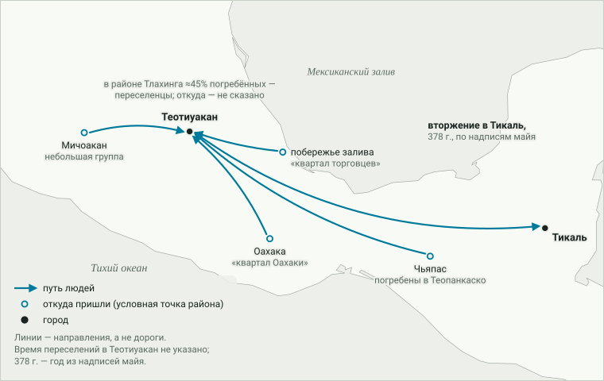
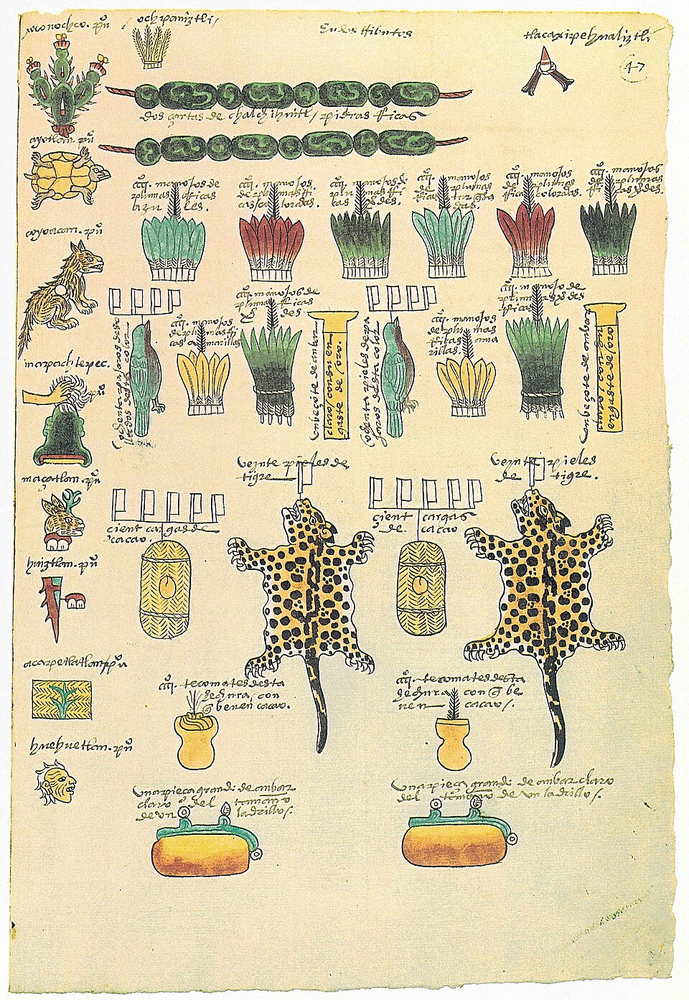

# 3. Сложные общества и цепочки посредников

> **Статус:** черновик.

[Глава 2](02-zemledelie.md) кончилась тем, что земледелие дало обществам
Америки запасы и рост населения, но сложные общества вырастали и там, где
кукуруза не была основой питания. Эта глава — о двух вещах, которые в таких
обществах видны лучше всего: как далеко и каким путём шли между ними вещи и
люди и как была устроена власть, которая этими вещами и людьми распоряжалась.

Опорный тезис конспекта № 2 во второй части говорит: регионы Америки были
связаны, но связь шла эстафетой. Вещь проходила через многие руки, ни один
участник не видел всей цепочки, а доказательства этого — сами вещи
(обсидиан, медь, морские раковины, перья ара, какао), а не тексты или
свидетельства прямых контактов. Глава проверяет тезис на тех случаях, где
путь вещи удалось проследить по её составу, и там, где двигались не вещи, а
люди.

Короткий итог проверки: тезис приходится разделить на части. Для связей
Мезоамерики с севером — с Миссисипи и, судя по ара и какао, с юго-западом
нынешних США — прямых контактов источники главы действительно не
показывают. Но «эстафета» — лишь один из нескольких способов, которыми вещь
могла пройти тысячу километров, и источники главы указывают на другие:
целевой поход к далёкому источнику, разведение птиц в промежуточном центре,
переселение целых групп людей, а в Андах — колонии. Природные пояса там
лежат друг над другом на коротком расстоянии, и община получала ресурсы
других поясов не столько обменом, сколько через своих поселенцев в них; на
этот лад держава инков переделывала и часть новых земель. А одна из самых
известных «дальних связей» — бирюза юго-запада в столице мешика (ацтеков) —
не подтвердилась: по анализу 43 бирюзовых пластинок, 38 из которых взяты из
одного священного участка столицы, бирюза последнего века перед испанцами,
скорее всего, местная, а сама бирюза, возможно, не была важным товаром в
обмене с юго-западом.

## Как вещь рассказывает о своём пути

Найденная вещь сама по себе говорит только, где она оказалась. Чтобы узнать,
откуда она пришла, у неё ищут «отпечаток» источника: состав меди, обсидиана
(вулканического стекла) или бирюзы немного различается от месторождения к
месторождению. Так, медь из курганов хоупвелла в Огайо сравнивают по дюжине
примесей с медью известных месторождений.[^seeman2026] Бирюзу из храма в
Теночтитлане сравнивают с месторождениями по изотопам свинца и стронция —
разновидностям атомов, соотношение которых зависит от возраста и состава
горных пород.[^thibodeau2018] Какао в сосуде выдаёт теобромин: какао — единственное
растение Мезоамерики, у которого это вещество, родственное кофеину, —
главное.[^crown2009] Похожим способом проверяют и людей: соотношение
[изотопов стронция](../glossary.md#изотопы-стронция-происхождение-человека)
в зубах отражает горные породы той местности, где человек
рос.[^davidson2021]

Но и отпечаток источника отвечает не на всё. Он говорит, откуда материал, а не
как он шёл. Симан, Хилл и Нолан, изучавшие медь хоупвелла, напоминают о двух
возможностях: далёкий материал могли добывать в целевых дальних походах — или
он мог переходить из рук в руки через весь материк.[^seeman2026] Второе и есть
[эстафетный обмен](../glossary.md#эстафетный-обмен), о котором говорит
тезис. Различить их можно лишь косвенно: эстафета должна оставлять следы
между источником и потребителем, а поход может их не оставить. Источники этой
главы добавляют ещё два пути — промежуточный центр, где нужное разводили или
изготовляли, и переселение самих людей (рисунок 3.1).

<picture>
  <source media="(prefers-color-scheme: dark)" srcset="img/03-modes-dark.svg">
  
</picture>

**Рис. 3.1.** Четыре пути, которыми вещь или человек могли пройти тысячу
километров, и следы, по которым их различают. Пути не исключают друг
друга: от промежуточного центра вещь могла идти дальше и из рук в руки, и
походом. *Схема:* расстояния и число участников условные; примеры к каждому
пути — в тексте главы.

## Вещи в пути: проверка тезиса

### Хоупвелл: медь Верхнего озера и Аппалачей, обсидиан Йеллоустона

[Хоупвелл](02-zemledelie.md#восток-своё-земледелие-до-кукурузы) — так археологи
называют сеть общих обрядов и обмена на востоке Северной Америки; в Огайо её
главные центры — с земляными сооружениями, курганами и подношениями из редких
материалов.[^seeman2023]
По [байесовской модели](../glossary.md#байесовская-модель-датировок) 66
наиболее надёжных радиоуглеродных дат шести главных центров, хоупвелл в Огайо
начинается около 90–120 гг. и кончается около 395–430 гг. — позже и короче,
чем принято было считать.[^seeman2023] В Огайо он, таким образом, занял около
трёх веков.[^seeman2023]

Медь хоупвелла шла из двух мест (рисунок 3.2). Главное — район Верхнего озера, где
самородной меди больше, чем где-либо в мире: полуостров Кивино и острова
Айл-Ройал и Мичипикотен лежат по прямой в 940–1060 км от центров
хоупвелла.[^seeman2026] Второе — южные Аппалачи, около 490 км к
югу.[^seeman2026] Из 64 медных вещей семи центров Огайо, исследованных одним
методом, 78% сделаны из меди Верхнего озера и 22% — из аппалачской; в
центре Маунд-Сити доля аппалачской меди — 42% (5 из 12 вещей), больше, чем в
других крупных центрах Огайо, где медь проверяли.[^seeman2026] Северная «медная тропа», по их выводу, старше
хоупвелла: по данным, которые они приводят, у предшествовавшей ему культуры
адена 61 из 63 изученных медных вещей — из района Верхнего озера, и ни одной —
из Аппалачей.[^seeman2026] С
юго-востока, кроме меди, шли слюда и морские раковины.[^seeman2026] Всего из
мест хоупвелла в Огайо известно, по оценке авторов, 270–360 кг меди или
больше.[^seeman2026]

Обсидиан пришёл с запада. Гордус, Гриффин и Райт ещё в 1960-х гг. сравнили
состав 87 обсидиановых вещей хоупвелла с месторождениями от Аляски до
Центральной Мексики: 68 совпали с Обсидиановым утёсом (Obsidian Cliff) в
Йеллоустоне, остальные 19 — с эталонным образцом из Филдовского музея в
Чикаго, о котором в каталоге сказано только «Йеллоустон», без точного
места.[^gordus1968]

Сколько времени обсидиан везли в Огайо, спорят. Хэтч и соавторы в 1990 г.
изучили ещё 34 вещи и по разнообразию их состава допустили и другие западные
источники.[^hatch1990] Сам обсидиан они датировали
[по гидратации](../glossary.md#гидратационное-датирование-обсидиана): свежий
скол этого стекла понемногу впитывает воду, и по толщине пропитанного слоя
рассчитывают, сколько лет прошло с тех пор, как вещь
изготовили.[^liritzis2021] Их даты растянулись на несколько веков, и в этом
авторы увидели долгий ввоз.[^hatch1990] Часть этих дат приходится ещё на время
до н. э. — раньше, чем начинается хоупвелл Огайо по модели радиоуглеродных
дат 2023 г.[^hatch1990][^seeman2023] Хьюз (1992) вывод оспорил: привязка части
вещей к месторождениям неоднозначна, точность измерений слоя и оценки
погрешности вызывают вопросы, скорости гидратации, полученные в лаборатории,
спорны, а измерения одной и той же вещи противоречат друг другу, — так что
данные, по его словам, не подтверждают, что обсидиан ввозили всё время, пока
строили курганы хоупвелла.[^hughes1992] Стивенсон (один из соавторов работы
1990 г.), Абдельрехим и Новак в 2004 г. измерили слой на вещах с памятника
Хоупвелл новым, более точным способом и снова пришли к выводу, что дальний
обмен обсидианом шёл весь хоупвелл — в тогдашних его рамках, около 200 г. до
н. э. – 500 г.[^stevenson2004] С новой, более короткой радиоуглеродной
хронологией хоупвелла эти даты источники главы не сопоставляют, так что
вопрос — ввозили обсидиан веками или за короткий срок — остаётся открытым.

> [!NOTE]
> **Оценка.** Что это значит для тезиса об эстафете? Симан, Хилл и Нолан
> пишут: если медь попадала в Огайо не прямым походом и не простой сделкой у
> источника, то следов такой цепочки «из рук в руки» между Верхним озером и
> долиной Огайо не сохранилось нигде.[^seeman2026] При этом большинство
> центров хоупвелла Огайо брали больше меди с двух труднодоступных островов,
> Айл-Ройала и Мичипикотена, чем с более доступного полуострова Кивино, хотя
> по прямой Мичипикотен даже чуть ближе Кивино (940 км против 960); на
> Айл-Ройал с Кивино надо было плыть около 90 км по опасной открытой
> воде.[^seeman2026] Тот же выбор островов, по данным, которые приводят авторы,
> был ещё у адена, а сама Маунд-Сити — исключение: медь Мичипикотена там не
> найдена.[^seeman2026] Авторы напоминают, что анишинабе (оджибве) почитают
> гору над Айл-Ройалом как место гнездовья Громовых птиц, а остров
> Мичипикотен — как дом Мишепешу, Подводной рыси, и пишут, что это позволяет
> допустить: дальние материалы вроде меди связывали хоупвелл не только с
> далёкими местами, но и со временем мифов.[^seeman2026] Это возможность,
> которую авторы допускают, а не доказательство похода: отсутствие следов
> посредников ещё не доказывает, что их не было.

Почему хоупвелл кончился, источники главы не объясняют. Одно громкое
объяснение — взрыв кометы над долиной Огайо, предложенный в статье 2022 г., —
разобрали Нолан и соавторы, а в 2023 г. журнал статью
отозвал.[^nolan2023][^tankersley2023]

### Чако: какао и ара — с юга, но не простой эстафетой

На юго-западе нынешних США, в каньоне Чако (Нью-Мексико), крупнейшее
поселение — Пуэбло-Бонито, многоэтажный дом примерно на 800 комнат; по
[дендрохронологии](../glossary.md#дендрохронология) его строили примерно с
860 по 1128 г.[^crown2009] Здесь найдено 166 из менее чем двухсот известных на
юго-западе цилиндрических сосудов — высоких и узких; по общему мнению
археологов, обрядовых.[^crown2009] Краун и Херст в 2009 г. нашли теобромин в трёх из пяти
исследованных черепков — именно в тех трёх, что, вероятно, были от
цилиндрических сосудов; черепки по стилю росписи относятся к ≈1000–1125
гг.[^crown2009] Так впервые было показано, что к северу от нынешней мексиканской
границы пили напиток из какао.[^crown2009]

Какао — тропическое дерево, которому нужны тень, влажный воздух, глубокие
наносные почвы, обильные дожди и жара; Чако лежит далеко за пределами области,
где его возделывали.[^crown2009] Ближайшие к Чако плантации, известные ко времени испанского завоевания (на четыре века
позже сосудов), были в Центральной Мексике, в том числе на севере Веракруса и в
Колиме; более крупные — южнее.[^crown2009] Откуда именно пришло какао Чако,
неизвестно: в то время, пишут авторы, какао могли торговать несколько
соперничавших государств Мезоамерики.[^crown2009] Краун и Херст считают, что
вместе с зёрнами пришло и знание того, как готовить и подавать напиток: на это,
по их мнению, указывает его связь с особыми цилиндрическими сосудами, как и в
обрядах Мезоамерики.[^crown2009]

Ещё яснее путь виден по ара. Скелеты сотен красных ара (*Ara macao*) найдены
на юго-западе США и северо-западе Мексики — больше чем в 1000 км от природного
ареала этих тропических птиц.[^george2018] По прямым радиоуглеродным датам
костей, в Пуэбло-Бонито ара были уже около 900–975 гг. и поступали постоянно
примерно до 1150 г.[^watson2015] Как они туда попадали? Одни исследователи
думали о прямых походах к северной границе ареала, другие — о передаче птиц
от общины к общине.[^george2018] Джордж и соавторы в 2018 г. прочли
митохондриальные геномы — наследуемую по материнской линии часть
наследственности — 14 ара из Чако и района Мимбрес на юго-западе Нью-Мексико, датированных
900–1200 гг.[^george2018] Разнообразие оказалось поразительно низким: у 10 из 14
птиц последовательность одна и та же, и все они относятся к одной редкой
материнской линии, которую среди диких ара знают только в Мексике и на севере
Гватемалы.[^george2018] Авторы заключают, что это не согласуется ни с прямым
отловом диких птиц, ни с передачей отдельных птиц от общины к общине из многих
далёких мест; по их выводу, где-то между ареалом и юго-западом было не
найденное ещё поселение, где ара разводили от немногих
предков.[^george2018] Давно известный центр разведения ара — Пакиме на
севере Мексики — относится к 1250–1450 гг., то есть позже этих
птиц.[^george2018] Но и для Пакиме, по Конраду и соавторам (2023), прямых
свидетельств разведения до сих пор нет, хотя на него указывают кости,
генетика, изотопы и обстановка находок.[^conrad2023] Первое прямое
свидетельство разведения на юго-западе нашли сами Конрад и соавторы: по
скорлупе яиц в начале XII в. ара разводили в районе Мимбрес — в поселении
Олд-Таун.[^conrad2023] Был ли Олд-Таун тем центром, от
которого пошли птицы всего края, авторы оставляют открытым и допускают, что
были и более ранние, ещё не найденные места разведения.[^conrad2023] Ара в
Пуэбло-Бонито, по прямым датам, появились раньше — около 900–975 гг., — и где
разводили их, пока неизвестно.[^watson2015][^george2018]

<picture>
  <source media="(prefers-color-scheme: dark)" srcset="img/03-routes-dark.svg">
  
</picture>

**Рис. 3.2.** Вещи в пути: что удалось проследить по составу вещей и генетике
птиц. Точка «Маунд-Сити» обозначает все центры хоупвелла
в Огайо; доли меди (78 и 22%) — по 64 вещам семи центров, а в самой
Маунд-Сити аппалачской меди 42%.[^seeman2026] *Данные:* по источникам,
указанным в тексте главы; линии — направления, а не прослеженные дороги; где
путь неизвестен, линия обрывается; положение точек ориентировочное. Пути людей —
на рисунке 3.3.

> [!NOTE]
> **Оценка.** Чако — лучший довод за первую половину тезиса: прямого контакта
> юго-запада с Мезоамерикой источники не показывают, а сами авторы не знают, из
> какого государства шло какао.[^crown2009] Генетика ара картину уточняет:
> Джордж и соавторы считают, что ни прямой отлов, ни передача отдельных птиц
> от общины к общине из многих далёких мест не объясняют их родства, и
> предполагают центр разведения между ареалом и юго-западом.[^george2018] Вывод
> конспекта: центр разведения меняет источник птиц — не дикие стаи, а
> одно хозяйство, — но не обязательно способ, которым они шли дальше; от
> такого центра до Чако их могли и передавать из рук в руки, и приносить
> походом, и как было на деле, источники главы не говорят. Как устроены
> были сами общества юго-запада, а также Пакиме и связи «переходной зоны», —
> тема [главы 4](04-perehodnaya-zona.md).

### Бирюза: дальняя связь, которая не подтвердилась

Больше 150 лет археологи считали, что государства Мезоамерики получали бирюзу
с юго-запада нынешних США и соседнего северо-запада Мексики: там известно
много древних бирюзовых копей, а в Мезоамерике — ни
одной.[^thibodeau2018] Многие полагали, что бирюзу меняли на ара, какао и
медные колокольчики, которые шли на север.[^thibodeau2018] Тибодо и
соавторы в 2018 г. проверили это по изотопам свинца и стронция 43 бирюзовых пластинок
из мозаик: 38 — из подношений в священном участке Теночтитлана, столицы
мешика (ацтеков), и 5 — из мозаик в стиле ньюу сави (миштеков); *ñuu savi*,
«народ дождя», — их самоназвание.[^thibodeau2018][^hernandezsantiago2016] Из 31
пластинки, для которой получены оба показателя, 29 лежат вне всего, что
известно для бирюзы юго-запада, а состав их близок к медным месторождениям
Мексики, особенно в нынешнем штате Мичоакан.[^thibodeau2018] Вывод авторов:
бирюза ацтеков и миштеков, скорее всего, добыта в самой Мезоамерике, и
бирюза, возможно, вообще не была важным товаром в обмене между юго-западом и
Мезоамерикой.[^thibodeau2018] Авторы оговаривают, что их данные относятся к
последнему веку перед испанским завоеванием, а о бирюзе других времён и мест
ничего не говорят.[^thibodeau2018]

Это урок для тезиса с неожиданной стороны. Предполагаемая «дальняя цепочка»
держалась не на находках по пути, а на том, что копи были известны только на
севере. Когда материал проверили, для бирюзы ацтеков и миштеков последнего
века перед испанцами эта цепочка не подтвердилась; о других временах и о
других вещах проверка ничего не говорит.

### Миссисипи и Мезоамерика: прямых следов нет

О связях Мезоамерики с востоком Северной Америки, где позднее выросла
[Кахокия](#вождества-миссисипи-кахокия), спорят давно, но, как пишет Карпентер
(2020), это представление держится, хотя ясно очерченных путей для таких
связей не найдено.[^carpenter2020] Археолог Алекс Кригер ещё в 1948 г. предложил два
сухопутных пути — через внутреннюю часть приморской равнины Мексиканского
залива и через южные Великие равнины и юго-запад.[^carpenter2020] По обзору Карпентера, данные первый путь не
подтверждают, а второй подтверждают сравнительно лучше; он предполагает, что
вещи и идеи шли из Мезоамерики через юго-запад, а дальше на восток их несли
посредники с южных равнин.[^carpenter2020] Даже в этой гипотезе связь — именно
цепочка посредников, а не прямой контакт.

## Люди, а не только вещи

Тезис говорит о вещах, но там, где у исследователей есть кости и зубы,
двигались и люди — иногда очень далеко (рисунок 3.3).

**Теотиуакан.** Город в долине Мехико, о размерах которого речь пойдёт ниже,
был, по выводу Манцанильи (2015), многоэтничным с
самого начала.[^manzanilla2015] На окраинах города жили группы из других мест:
в «квартале Оахаки» на юго-западе, в «квартале торговцев» с побережья
Мексиканского залива на востоке, небольшая группа из Мичоакана на западе; их
выдают свои погребальные обычаи, привозная посуда и скелеты, по которым
определено происхождение.[^manzanilla2015] В квартальном центре Теопанкаско
похоронены и местные жители, и переселенцы из соседних областей, и люди
издалека — с побережья залива, из Оахаки и Чьяпаса.[^manzanilla2015] По данным
2021 г., переселенцы составляли около 45% погребённых в трёх жилых комплексах
района Тлахинга, и приток не прекращался за всю историю
района.[^buckley2021] Зелёный камень жадеит из долины Мотагуа (на территории
нынешних Гондураса и Гватемалы) и слюда из Оахаки, по Манцанилье, были под контролем правящей
верхушки города, а другие ценности добывали и распределяли главы
кварталов.[^manzanilla2015]

**Тикаль.** Связь Теотиуакана с майя известна не только по вещам, но и по
надписям. Надписи Тикаля, большого города майя, рассказывают о военном
вторжении из Теотиуакана в 378 г., а главное действующее лицо этих событий
называют Сихьяй Кʼахкʼ («Рождённый огнём»).[^houston2021] Хьюстон и соавторы
в 2021 г. описали в Тикале комплекс, который в уменьшенном примерно на
30% виде, вероятно, повторяет «Цитадель» и храм Пернатого Змея в Теотиуакане и
ориентирован так же, как сетка улиц этого города.[^houston2021] Строили его
в основном в раннеклассический период, около 300–550 гг.; в нём найдены
курильницы теотиуаканского стиля и наконечники из зелёного обсидиана,
похожие на теотиуаканские.[^houston2021] Надписи здесь говорят не о посредниках,
а о прямом вмешательстве.

<picture>
  <source media="(prefers-color-scheme: dark)" srcset="img/03-people-dark.svg">
  
</picture>

**Рис. 3.3.** Люди в пути: переселенцы в Теотиуакане и вторжение из
Теотиуакана в Тикаль. Кахокии и долины Чинча на карте нет: для переселенцев
Кахокии направление неизвестно, а Анды — за пределами карты; о них — в тексте
ниже. *Данные:* по источникам, указанным в тексте раздела; линии —
направления, а не прослеженные дороги; точки районов условные.

**Кахокия.** Слейтер, Хедман и Эмерсон в 2014 г. измерили изотопы стронция в
зубах людей из разных погребений в окрестностях Кахокии, на Миссисипи, и
сравнили с местным фоном, установленным по костям животных: треть погребённых
выросла не на месте, причём, судя по разбросу значений, в разных
местах.[^slater2014] По Тейнтеру, переход к новому большому поселению
сопровождался тем, что окрестные возвышенности заметно опустели: люди, видимо,
перебрались в низину, многие — в саму Кахокию.[^tainter2019]

**Анды.** Древняя ДНК 21 человека из долины Чинча на юге Перу показала общее
происхождение с группами, жившими в 700 км к северу, и переселение,
начавшееся не позже XIII в., — ещё до прихода инков.[^bongers2026] Об
инкском переселении целых общин — ниже.

> [!NOTE]
> **Оценка.** Дальние связи в Америке не сводились к вещам, переходившим из
> рук в руки. Внутри Мезоамерики люди переселялись издалека и жили
> в чужом городе своими кварталами, а Теотиуакан, по надписям майя, вмешался в
> дела Тикаля напрямую.[^manzanilla2015][^houston2021] Купцы Мезоамерики в последний век перед
> испанцами, по словам Тибодо и соавторов, действовали и внутри, и за
> пределами своих государств.[^thibodeau2018] Тезис об эстафете точнее относить к связям
> *между* большими регионами — Мезоамерикой и севером, — чем к связям внутри
> них. Это вывод конспекта из сопоставления источников.

## Море: Эквадор и Западная Мексика

Один дальний путь шёл, возможно, морем. Металлургия, по Дороти Хослер, появилась
в Мезоамерике не на месте: её принесли морским путём из Центральной и Южной
Америки в Западную Мексику.[^hosler1988] Хослер в статье 1988 г. относит это
примерно к 800 г.; в её книге 1994 г. первый период западномексиканской
металлургии датирован 600–1200/1300 гг.[^hosler1988][^hosler1994] В первый
период, по её выводу, техника ближе всего к металлургии Эквадора, Колумбии и
юга Центральной Америки, во второй добавились приёмы из южного Перу, но
мастера Западной Мексики всё перерабатывали по-своему.[^hosler1988]

Было ли такое плавание возможно? Каллахан (2003) смоделировал плавание вдоль
берега на парусных плотах: путь на север мог занять всего около двух месяцев,
обратный, на юг, — не меньше пяти, возможно с уходом далеко от берега на целый
месяц.[^callaghan2003] О дальнем обмене на этом побережье есть и андские
данные: крупные общества побережья Эквадора и севера Перу, по Вернке, пускали
в дальний обмен бронзовые «топоры-деньги», бусы из раковин и золота и
продолжали это и под властью инков.[^wernke2022] Шёл ли этот обмен морем и
доходил ли до Западной Мексики, Вернке не пишет — эту связь проводит
конспект.

> [!IMPORTANT]
> **Гипотеза.** Металлургия Западной Мексики пришла морем с побережья Эквадора
> и соседних земель. Это вывод Хослер из сходства техники, а не прямое
> свидетельство плавания; расчёт Каллахана показывает, что такие плавания были
> возможны, а не то, что они были.[^hosler1988][^callaghan2003] Если гипотеза
> верна, это была дальняя связь в обход сухопутной эстафеты — по морю,
> напрямую или с немногими остановками. Критику гипотезы источники главы не
> разбирают.

## Как была устроена власть

Сложные общества Америки различались не только размером. В источниках главы
видны по меньшей мере три способа собрать с многих людей труд и продукты.
Первый — власть вождя над окрестными общинами. Два других — способы, которыми
правят [государства](../glossary.md#государство): гегемония, то есть
господство над чужими правителями, оставленными на местах, и прямое
управление, при котором государство само распоряжается трудом подданных.
Одна держава может сочетать оба, в разных землях по-разному. Слова для них
в конспекте — [вождество](../glossary.md#вождество-chiefdom),
государство и [гегемония данников](../glossary.md#гегемония-данников-империя);
шкала здесь — словарь, а не лестница.

### Вождества Миссисипи: Кахокия

Кахокия на Миссисипи — крупнейший
археологический памятник к северу от Мексики по любой мере: площади, числу
жителей, числу курганов (до 120) и размеру главного из них, Монкс-Маунда,
высотой больше 30 м.[^holt2009] Кукуруза, как говорилось в [главе
2](02-zemledelie.md), вошла здесь в рацион резко, около 900 г., и, по Эмерсону
и соавторам, вместе с общественными и религиозными переменами помогла
возникновению Кахокии около 1050 г.[^emerson2020]

Сколько людей жило в Кахокии, спорят. Паукетат и Лопино (1997) оценили
население в фазе Ломанн в 10 200–15 300 человек, тогда как незадолго до того,
по их же оценке, здесь жили 1400–2800; на эти оценки опирается Тейнтер
(2019).[^tainter2019] Фаза Ломанн — около 1050–1100 гг., время наибольшего
населения Кахокии и по Паукетату с Лопино, и по Милнеру.[^white2019] Милнер (1998), по пересказу Холт, считал, что жителей
было лишь несколько тысяч.[^holt2009] Спор не только о числе: по
Милнеру, при немногих жителях Кахокии не нужны были ни большие сборы, ни
обширная торговля и дань.[^holt2009] Холт пишет, что
большинство археологов видят в Кахокии центр вождества, меньшинство — центр
государства, а сама она предлагает третье: «государство-театр», которое
притягивало людей не силой, а обрядами, в которых те хотели
участвовать.[^holt2009]

Упадок Кахокии начался задолго до прихода европейцев. По той же оценке
Паукетата и Лопино, в следующей фазе Стерлинг население сократилось до 5200–7200
человек, затем до 3000–4500.[^tainter2019] О причинах спорят. Муньос и
соавторы (2015) по отложениям в озёрах поймы нашли, что с 600 по 1200 г. на
Миссисипи не было крупных наводнений, а после 1200 г. они вернулись, и около
1350 г. и Кахокия, и её окрестности опустели.[^munoz2015] Байрс, Балтус и Бьюкенен
ответили письмом в тот же журнал; уже его название — «Корреляция — не
причинность: под вопросом Великое наводнение в Кахокии» — выражает их
сомнение.[^baires2015] Уайт и соавторы
(2019) по следам человеческих отходов в озёрных отложениях связали сокращение
населения с наводнениями и летними засухами около 1150 г.[^white2019] А
Ранкин и Мюллер (2024) показали, что растительность у Кахокии не отозвалась на
многолетнюю засуху конца XIII в., и подчёркивают, что о том, как засухи и
наводнения сказывались на посевах, известно ещё мало.[^rankin2024]

### Мезоамерика: гегемония вместо прямого управления

В Мезоамерике, по обзору Чейза, Чейз и Смита (2009), государства в целом
тяготели к гегемонии, а не к прямому управлению
территорией.[^chase2009] Лучше всего известен Тройственный союз —
Теночтитлан, Тескоко и Тлакопан.[^chase2009] Росс Хассиг первым назвал его
державу гегемонией: большинство покорённых городов-государств оставались
сами по себе, пока платили дань столицам.[^chase2009] Бердан и соавторы
(1996) выделили в ней два пояса: внутренние провинции платили дань регулярно
— их списки есть, например, во второй части Кодекса Мендосы, — а внешние
«государства-клиенты» охраняли границы державы и посылали столицам «подарки»,
но не дань.[^chase2009] Основой жизни большинства людей оставался свой
город-государство (*альтепетль* на науатль) — обычно около 90 км²
территории.[^chase2009] Соседнее государство пурепеча (тарасков) с центром в
Цинцунцане было, по тому же обзору, более централизованным и
«территориальным», и две державы за несколько десятилетий до испанцев пришли
к военному равновесию.[^chase2009] Имперские годы Тройственного союза Тибодо и
соавторы датируют примерно 1430–1519 гг.[^thibodeau2018]

<picture>
  
</picture>

**Рис. 3.4.** Кодекс Мендосы, лист 47r: дань провинции Шоконочко. Подписи на
испанском называют, среди прочего, *cient cargas de cacao* («сто тюков
какао»), *veynte pieles de tigre* («двадцать шкур ягуара») и *sartas de
chalchihuitl* — нити «дорогих камней». *Первоисточник:* рукопись, созданная в
Новой Испании во второй четверти XVI в. — по каталогу Бодлианской библиотеки
(Оксфорд), между 1529 и 1553 гг.; часто называемая дата около 1541 г. держится
на спорном отождествлении рукописи с книгой из показаний Херонимо
Лопеса.[^codexmendoza] Роспись приписывают мастеру-писцу Франсиско
Гуальпуйогуалькалю (так её передаёт каталог); репродукция — Wikimedia
Commons, общественное достояние.[^codexmendoza]

Кодекс Мендосы (рисунок 3.4) показывает, как выглядела гегемония на деле.
Провинция Шоконочко (нынешнее Соконуско) лежала на тихоокеанском побережье,
на крайнем юго-востоке нынешней Мексики, больше чем в 1000 км от столицы; это
была дальняя окраина державы, а главным богатством края с давних времён было
какао.[^rojas1989] В столицу оттуда шли не только продукты, но и редкие вещи —
перья, зелёные камни, какао, шкуры.

> [!NOTE]
> **Оценка конспекта.** Часть того, что тезис называет «цепочками», в
> Мезоамерике последнего века перед испанцами была данью: вещь шла к центру не
> от соседа к соседу, а по приказу. Это относится только к имперским годам
> Тройственного союза, около 1430–1519 гг.[^thibodeau2018] Какао в Чако пили
> на несколько веков раньше, около 1000–1125 гг., так что для Чако этот
> механизм ничего не объясняет.[^crown2009]

Похоже ли так было устроено и раньше? Для Теотиуакана, по Чейзу, Чейз и Смиту,
характерно другое: в его искусстве и постройках почти нет явных изображений
правителей, нет бесспорного дворца и царских гробниц.[^chase2009] Смит и
Монтьель (2001) считают, что Теотиуакан правил державой около 20 500 км² в
Центральной Мексике, а Чейз и соавторы сомневаются, что его прямая власть
выходила далеко за долину Мехико, и считают, что до низменностей майя она почти
наверняка не доходила.[^chase2009] Главные обрядовые и правительственные постройки
Теотиуакана около 550 г. сгорели; следов внешнего нашествия нет, и Манцанилья
толкует это как восстание против правящей верхушки.[^manzanilla2015] У майя
спорят, были ли их классические царства независимыми городами-государствами
или Тикаль и Калакмуль стояли во главе двух «сверхдержав», как считают Мартин и
Грубе; Чейзы занимают промежуточную позицию.[^chase2009]

Размеры городов здесь тоже известны только оценками. Для Теотиуакана в пору
расцвета Миллон давал от 75 000 до более чем 200 000 жителей (125 000 —
«вероятно»), Коуджилл — 85 000–125 000, а Смит и соавторы (2019) по новому
анализу плана города считают наиболее разумной оценку около
100 000.[^smith2019] Для Теночтитлана разброс ещё шире: Эванс (2013) считает
разумной оценкой около 50 000 человек в самом городе и до 100 000 вместе с
соседними городами на берегу и напоминает, что встречаются и оценки в
полмиллиона.[^evans2013] Осса, Смит и Лобо (2017) исходят из примерно 200 000
жителей.[^ossa2017] Для Кахокии оценки тоже расходятся (см. выше): у Милнера —
несколько тысяч жителей, а чаще, по словам Холт, называют 10 000 или
20 000.[^holt2009] Паукетат и Лопино для фазы Ломанн, поры расцвета, дают
10 200–15 300 человек.[^tainter2019] Сравнение на рисунке 3.5 честнее любого одного числа.

<picture>
  <source media="(prefers-color-scheme: dark)" srcset="img/03-population-dark.svg">
  
</picture>

**Рис. 3.5.** Сколько людей жило в крупнейших городах: оценки разных авторов.
*Оценки:* по источникам, указанным в тексте главы; шкала логарифмическая,
среднего между оценками нет намеренно.

### Анды: труд вместо дани вещами

Инки называли свою державу Тауантинсуйу — примерно «владение из четырёх
частей».[^davidson2021] К приходу испанцев она занимала, по Вернке, около
миллиона квадратных километров и около 10 млн жителей, а по Дэвидсон и
соавторам — около 2 млн км²; оценки населения Анд ко времени контакта, которые
они приводят, — от 3,0 до 33,8 млн человек.[^wernke2022][^davidson2021] Уже
этот разброс показывает, как мало здесь известно точно.

Главным в хозяйстве державы, по Вернке, был не обмен и не дань вещами, а труд:
подданные отрабатывали [трудовую повинность](../glossary.md#мита), продукты этого
труда свозили на государственные склады, а чиновники учитывали и
перераспределяли их — на прокорм войска, на запас на голодные годы, на
постройку дорог, каналов, террас и храмов.[^wernke2022] Деньги в
хозяйстве державы, по Вернке, не столько «отсутствовали», сколько были не
нужны: инки знали обмен на «топоры-деньги» у прибрежных соседей (о них —
выше), но в своё хозяйство деньги не включали.[^wernke2022] Учёт вели на
[кипу](../glossary.md#кипу) — узелковых шнурах с десятичной записью чисел;
кипу инкского времени известно около 1300, более ранних — меньше двадцати, и
самые ранние, с явными правилами записи, оставило государство Уари в VII–IX
вв.[^wernke2022] Дороги державы, по описанию ЮНЕСКО, составляли сеть больше
30 000 км и частично опирались на дороги, построенные до
инков.[^unesco2014] По ним бегали гонцы-скороходы, передававшие вести и кипу по
цепочке.[^wernke2022]

Вторая черта — переселения. По колониальным хроникам, инки переселили от
четверти до трети всего населения Анд, и исследователи с этой долей в целом
согласны; Д'Олтрой оценивает число насильственно переселённых в 3
млн.[^davidson2021] Переселенцев — [митмакуна](../glossary.md#митмак-митмакуна)
— сажали на новые земли, чтобы предотвращать восстания, поднимать хозяйство и
смешивать народы под властью инков.[^davidson2021] При этом подданным
предписывалось сохранять свою одежду и другие знаки своего народа, даже если их
переселяли далеко.[^wernke2022] Изотопы и древняя ДНК начинают проверять
хроники: так, переселенцы, похороненные в Мачу-Пикчу, оказались в основном
людьми, служившими государству и знати (их называли аклья и янакуна), а не
колонистами-митмакуна; данных пока мало.[^davidson2021]

Власть инков не была везде одинаково прямой. Вернке описывает её как мозаику —
от покровительства местным правителям и непрямого управления через их
наследственную знать до прямого управления.[^wernke2022] И главное для
тезиса этой главы: в центральных Андах, по Вернке, дальние ресурсы получали не
через торговцев, а через колонии своих людей в разных природных поясах,
связанные с горным политическим центром; а на
северной границе державы инки застали небольшие общества, где дальний обмен
вели особые торговцы, и, включив их в державу, постепенно переделывали на
центральноандский лад.[^wernke2022]

Почему колонии, а не торговля? Природные пояса в Андах лежат друг над другом
на коротком расстоянии: на юге Перу, в долинах Наски и Пальпы, от берега океана
до вершины высотой 4487 м — всего около 120 км, а между побережьем на западе и
тропическими низменностями на востоке сменяются несколько поясов, и каждый
даёт своё сырьё и свои урожаи.[^mader2023] Поэтому община могла держать
постоянные поселения своих людей сразу в нескольких поясах, обычно на землях
других народов, и получать оттуда нужное напрямую: такую модель по испанским
описям горных областей Перу 1560-х гг. построил Джон Мурра, и её называют
[«вертикальным архипелагом»](../glossary.md#вертикальный-архипелаг).[^mader2023]
Мадер и соавторы (2023) напоминают, что модель гибкая, но расплывчатая и
археологически её проверить трудно: в Андах почти любое хозяйство так или
иначе пользуется несколькими поясами.[^mader2023]

У инков были предшественники. Государство Уари (≈600–1000), по выводу Конли и
соавторов, основало колонию в долине Наска на побережье.[^conlee2021]
Тиуанако возникло около 180 г., около 600 г. стало главной
целью переселенцев в регионе и одним из первых городов Анд, а около 1010–1050
гг. быстро пришло в упадок — раньше, чем засуха, так что, по выводу Марша и
соавторов, засуха не была его причиной.[^marsh2023] Пярссинен и Корписаари
(2024) прослеживают в районе озера Титикака преемственность обрядов и построек
от Тиуанако к инкам.[^parssinen2024]

| | Кахокия (Миссисипи) | Тройственный союз | Тауантинсуйу |
|---|---|---|---|
| Чем держится власть | обряды и стройки центра; вождество или «государство-театр» — спорно | военная сила столиц и дань | повинность трудом, склады, учёт |
| Кто правит на местах | — (данных о дальних землях нет) | местные правители, пока платят | от местной знати до прямых чиновников |
| Что идёт в центр | труд на постройки; дань — спорно | продукты и редкие вещи по спискам | труд и его продукты; переселенцы |
| Учёт | неизвестен | рисуночные списки дани | кипу |
| Дальние вещи | обмен, пути не прослежены | дань и купцы | колонии в разных поясах; торговцы на окраинах |

Таблица сводит сказанное выше; источники — в тексте раздела.

### Хронология инков: спор последних лет

Сколько длилась держава инков, ещё недавно отвечали по хроникам: Пачакути
пришёл к власти около 1438 г., Мачу-Пикчу начали строить около 1450–1460
гг.[^ziolkowski2020] По тем же хроникам, поход на север, в нынешний Эквадор,
начался в 1463 г., а на юг, в нынешнюю Аргентину, — в 1471
г.[^marsh2017] Дата 1438 стоит и в [графе
родословной](https://wesaix.github.io/abya-yala/visuals/genealogy/).

Радиоуглерод их сдвигает. Огберн (2012) по датам крепости Чамикаль на юге
Эквадора заключил, что продвижение на север началось на одно-два десятилетия
раньше, чем позволяют хроники.[^ogburn2012] Он же предложил объяснение
расхождения: инкские записи о завоеваниях, по-видимому, перечисляли провинции
по географии, а испанские авторы прочли этот порядок как
хронологический.[^ogburn2012] Марш и соавторы (2017) построили байесовские
модели: Чамикаль заселён в 1410–1480 гг., а инки появились на юго-востоке
державы, в нынешней провинции Мендоса, в 1350–1440 гг. и пробыли там 70–230
лет.[^marsh2017] Их вывод — пора отказаться от традиционной хронологии в
пользу байесовских.[^marsh2017] Бургер и соавторы (2021) по датам погребений
показали, что в Мачу-Пикчу жили примерно с 1420 г. — на два десятилетия раньше
хроник.[^burger2021] Пярссинен и Корписаари (2024) пишут, что инкская посуда и
постройки были у Титикаки уже в XIV в.[^parssinen2024]

<picture>
  <source media="(prefers-color-scheme: dark)" srcset="img/03-inca-chronology-dark.svg">
  
</picture>

**Рис. 3.6.** Хронология инков: даты хроник и даты радиоуглерода. *Данные:*
по источникам, указанным в тексте главы; полосы — интервалы по моделям авторов
(у Марша и соавторов — с вероятностью 95%).

> [!NOTE]
> **Оценка.** На 2012–2024 гг. все разобранные здесь радиоуглеродные работы
> сдвигают начало экспансии инков раньше хроник — на десятилетия, а на юге,
> может быть, и на век.[^marsh2017][^burger2021] Это ещё не новая общепринятая
> хронология: данных мало, они относятся к отдельным памятникам, а модели
> пересчитываются с каждой новой серией дат. Но «1438» уже нельзя подавать как
> установленную дату начала державы — только как дату хроник.

## Что общего у сложных обществ без кукурузы

[Глава 2](02-zemledelie.md#что-меняет-земледелие--и-чего-не-меняет) оставила
вопрос: у хоупвелла, Кахокии и северо-западного побережья разная основа
питания — местные растения, кукуруза и рыба. Что же у них общего?

Кандидатов два. Эмерсон и соавторы (2020) считают, что кукуруза дала Кахокии
надёжность питания, которая вместе с общественными, политическими и
религиозными переменами позволила ей возникнуть.[^emerson2020] Эрик Смит и
Брайан Коддинг (2021), сравнив 89 обществ охотников и собирателей
тихоокеанского побережья, нашли, что устойчивое неравенство сильнее всего там,
где люди зависели от богатых сосредоточенных угодий — прежде всего лососёвых
рек — и владели ими; по их выводу, это согласуется с моделями, в которых
власть возникает у тех, кто держит доступ к богатым и легко защищаемым
угодьям.[^smith2021] Тейнтер подчёркивает, что и Кахокия стояла в месте
высокой природной и земледельческой продуктивности.[^tainter2019]

> [!IMPORTANT]
> **Гипотеза конспекта.** Два объяснения могут быть не соперниками, а двумя
> сторонами одного: богатое и сосредоточенное угодье — речная пойма или
> лососёвая река — само даёт надёжность питания, а тот, кто им владеет,
> получает и власть. Тогда общее у Кахокии и северо-запада — не то, чем люди
> кормились, а то, где они жили: богатое угодье. Хоупвелл в эту схему укладывается хуже: Симан и соавторы описывают
> его как свободно устроенную межрегиональную сеть, и источники главы не
> показывают у него устойчивого наследственного неравенства, как у
> северо-запада.[^seeman2026] Проверить гипотезу можно было бы сравнением, где
> богатство угодий и неравенство измерены одинаково для земледельцев и
> охотников; источники главы такого сравнения не дают, а Смит и Коддинг
> изучали только охотников и собирателей.[^smith2021]

**Колесо.** В Мезоамерике колесо знали, но, по словам Дила и Мандевиля
(1987), в доколумбовой Америке оно было обычным лишь в одном небольшом круге
вещей — у фигурок животных на колёсиках.[^diehl1987] Города Мезоамерики
выросли, по формулировке Чейз и соавторов (2023), несмотря на то, что не было
ни вьючных животных, ни колёсного транспорта.[^chase2023] В Андах вьючное
животное было — лама. Фань и соавторы, изучавшие геномы лам и альпак, во
введении к статье пишут со ссылкой на статью Гейда (1996), что лама
как вьючное животное помогла расширению державы инков.[^fan2020] Но
колёсного транспорта не появилось и там. Почему колесо не стало транспортом
ни в Мезоамерике, ни в Андах, источники главы не разбирают, а привычные
объяснения — нет тягловых животных, горный рельеф, нет дорог для повозок —
проверить по ним не удалось.

## Вывод

Вторая часть тезиса № 2 держится там, где её труднее всего проверить, и
требует уточнения там, где путь вещей удалось проследить.

Держится она для связей между большими регионами. Прямых контактов
Мезоамерики с Миссисипи источники главы не показывают, и даже гипотеза о
дальнем пути предполагает посредников. Какао и ара пришли на юго-запад из
Мезоамерики, но источник какао неизвестен, и прямого контакта не видно. Для
меди и обсидиана хоупвелла источник установлен, а путь — нет: следов
посредников между Верхним озером и Огайо не нашли, но и поход не доказан.

Уточнять её приходится в трёх местах. Во-первых, в пути вещи могли быть
звенья другого рода, чем руки посредников: генетика ара говорит о
специальном разведении птиц где-то между их ареалом и юго-западом. Это меняет
источник птиц, но не обязательно способ передачи: как они шли от центра
разведения до Чако — из рук в руки или походами, — неизвестно. То, что
хоупвелл брал медь больше с труднодоступных островов, — давний выбор, он был
ещё у адена, и сам по себе он не говорит, ходили ли за медью сами или она шла
по цепочке. Во-вторых, двигались и люди. Внутри Мезоамерики почти половина
погребённых в одном районе Теотиуакана — переселенцы, а Теотиуакан вмешался в
дела Тикаля; в Андах переселения шли ещё до инков, а инки переселяли целые
общины. И на севере, в окрестностях Кахокии, треть погребённых выросла не на
месте. В-третьих, часть предполагаемых дальних связей может не подтвердиться,
как бирюза юго-запада в Теночтитлане, — по крайней мере для последнего века
перед испанцами.

Во власти источники показывают три разных устройства: вождества Миссисипи
(или «государство-театр» Кахокии — это спорно), гегемонию Тройственного союза
с данью и местными правителями и державу инков, которая брала с подданных
прежде всего труд и переселяла их, хотя и она правила частью земель
непрямо.

Следующая, [глава 4](04-perehodnaya-zona.md), — о самом юго-западе и севере
Мексики: как были устроены общества, куда приходили какао и ара, что такое
Пакиме, где ара, по-видимому, разводили позже, и как через эту «переходную
зону» шли связи с Мезоамерикой. Различие в устройстве власти понадобится в
[главе 6](06-udar-po-centru.md), где речь пойдёт о том, как эти державы
встретили завоевателей; а сети обмена и переселений, по которым шли вещи и
люди, — в [главе 5](05-epidemii.md) о путях эпидемий.

| Часть тезиса № 2 | Что показывают источники | Итог |
|---|---|---|
| Связи — через посредников, а не прямые | Между Мезоамерикой и севером прямых контактов не видно; внутри Мезоамерики и Анд — переселения и прямое вмешательство | держится для связей между большими регионами |
| Вещь проходит через многие руки | У ара — разведение между ареалом и юго-западом, а путь от него до Чако неизвестен; у меди хоупвелла следов посредников нет, но и поход не доказан | не доказано и не опровергнуто: прослежены источники вещей, а не их пути |
| Доказательства — вещи, а не тексты | Надписи майя о Теотиуакане, изотопы и ДНК людей, Кодекс Мендосы | дополняется: есть и надписи, и кости |
| Дальние связи существовали | Бирюза юго-запада в Теночтитлане последнего века перед испанцами не подтвердилась (43 пластинки, 38 — из одного священного участка) | одна из «связей» не подтвердилась — для одного времени и места |

Что может измениться. Хронология хоупвелла в Огайо пересчитана в 2023 г., а
медь Маунд-Сити исследована в 2026 г.[^seeman2023][^seeman2026] Центр разведения
ара 900–1200 гг. ещё не найден.[^george2018] Сомнения в традиционной хронологии
инков появились ещё в предшествующие десятилетия; радиоуглеродные работы,
разобранные в главе, — самая ранняя из них Огберна (2012) — опираются пока на
отдельные памятники.[^ogburn2012][^marsh2017] Подробные данные древней ДНК
есть пока для немногих людей Анд, и Дэвидсон и соавторы (2021) называют это
серьёзным ограничением таких исследований.[^davidson2021] Здесь каждая новая
работа может сдвинуть картину.

## Источники

[^seeman2026]: Seeman, Hill & Nolan 2026, аннотация, разд. «Context of Our Evaluation», «Results», «Discussion», примеч. 1 (полный текст, открытый доступ).
[^thibodeau2018]: Thibodeau et al. 2018, аннотация, введение, «Results», «Discussion» (полный текст, PMC6007158).
[^crown2009]: Crown & Hurst 2009, аннотация и основной текст (полный текст, PMC2650116).
[^slater2014]: Slater, Hedman & Emerson 2014, аннотация (только аннотация).
[^davidson2021]: Davidson, Fehren-Schmitz & Llamas 2021, аннотация, разд. 1–2, 3.1, 4, 7 (полный текст, PMC7913103).
[^seeman2023]: Seeman & Nolan 2023, аннотация и разд. о модели всех дат (полный текст, открытый доступ).
[^gordus1968]: Gordus, Griffin & Wright 1968, разд. «Middle Woodland Obsidian» (полный текст, OSTI 4758582).
[^hatch1990]: Hatch et al. 1990, аннотация (только аннотация).
[^hughes1992]: Hughes 1992, аннотация (только аннотация).
[^stevenson2004]: Stevenson, Abdelrehim & Novak 2004, аннотация (только аннотация).
[^liritzis2021]: Liritzis & Laskaris 2021, аннотация и разд. 1 (полный текст, открытый доступ).
[^nolan2023]: Nolan et al. 2023 (полный текст, PMC10412550).
[^tankersley2023]: Retraction Note, Scientific Reports 2023 (полный текст, PMC10468503).
[^george2018]: George et al. 2018, аннотация, введение, «Results», «Discussion» (полный текст, PMC6126748).
[^watson2015]: Watson et al. 2015, аннотация.
[^conrad2023]: Conrad et al. 2023, аннотация.
[^carpenter2020]: Carpenter 2020, аннотация (только аннотация).
[^manzanilla2015]: Manzanilla 2015, аннотация и основной текст (полный текст, PMC4522775).
[^buckley2021]: Buckley et al. 2021, аннотация.
[^houston2021]: Houston et al. 2021, основной текст (полный текст, открытый доступ).
[^tainter2019]: Tainter 2019, с. 4–7 (полный текст, открытый доступ).
[^bongers2026]: Bongers et al. 2026, аннотация.
[^hosler1988]: Hosler 1988, аннотация (только аннотация).
[^hosler1994]: Hosler 1994, оглавление (только описание).
[^callaghan2003]: Callaghan 2003, аннотация (только аннотация).
[^wernke2022]: Wernke 2022, разд. 3–5 (полный текст, открытый доступ).
[^holt2009]: Holt 2009, с. 231–233, 236 (полный текст).
[^emerson2020]: Emerson et al. 2020, аннотация.
[^munoz2015]: Munoz et al. 2015, аннотация (полный текст, PMC4443319).
[^baires2015]: Baires, Baltus & Buchanan 2015 (только описание).
[^white2019]: White et al. 2019, аннотация (полный текст, PMC6431169).
[^rankin2024]: Rankin & Mueller 2024, аннотация (только аннотация).
[^chase2009]: Chase, Chase & Smith 2009, с. 175–178 (полный текст).
[^smith2019]: Smith et al. 2019, аннотация и введение (полный текст, открытый доступ).
[^evans2013]: Evans 2013, с. 549, врезка «How many people lived in Tenochtitlan?» (фрагмент).
[^ossa2017]: Ossa, Smith & Lobo 2017, с. 470–471 (полный текст, открытый доступ).
[^unesco2014]: UNESCO World Heritage Centre, Qhapaq Ñan, описание объекта (полный текст).
[^conlee2021]: Conlee et al. 2021, аннотация.
[^marsh2023]: Marsh et al. 2023, аннотация и табл. 1 (полный текст, PMC10664893; версия, переизданная 18 января 2024 г.).
[^parssinen2024]: Pärssinen & Korpisaari 2024, аннотация.
[^ziolkowski2020]: Ziółkowski et al. 2020, аннотация.
[^marsh2017]: Marsh et al. 2017, аннотация.
[^ogburn2012]: Ogburn 2012, аннотация.
[^burger2021]: Burger et al. 2021, аннотация.
[^smith2021]: Smith & Codding 2021, аннотация.
[^diehl1987]: Diehl & Mandeville 1987, аннотация (только аннотация).
[^chase2023]: Chase et al. 2023, аннотация.
[^fan2020]: Fan et al. 2020, аннотация и введение (полный текст, PMC7331169).
[^mader2023]: Mader, Reindel & Isla 2023, введение, разд. «Verticality and Ecological Complementarity» и «Evidence from the Northern Nasca Drainage» (полный текст, открытый доступ).
[^rojas1989]: Rojas 1989, с. 91–92 (полный текст, открытый доступ).
[^hernandezsantiago2016]: Hernández Santiago et al. 2016, введение (полный текст, PMC5011354).
[^codexmendoza]: Codex Mendoza, л. 47r (изображение); датировка и атрибуция — по каталогу Бодлианской библиотеки (MS. Arch. Selden. A. 1).
