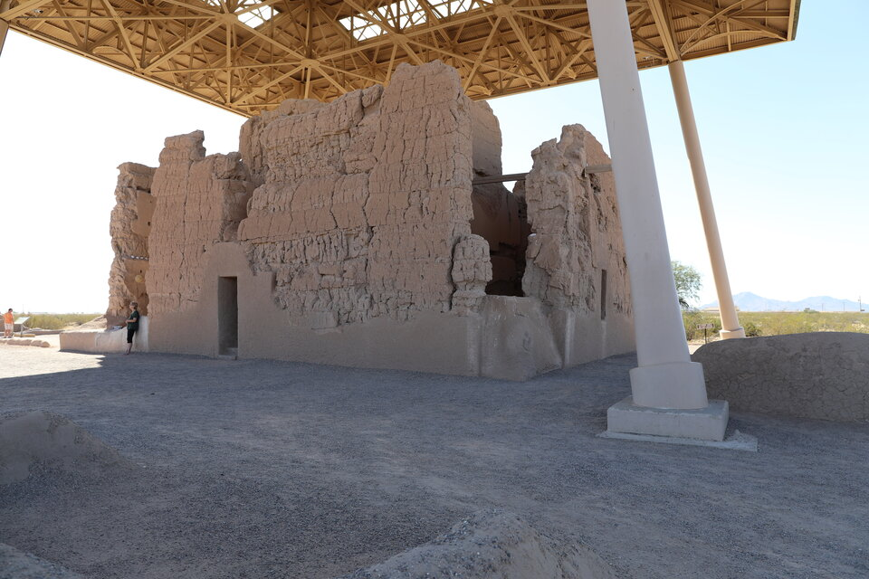
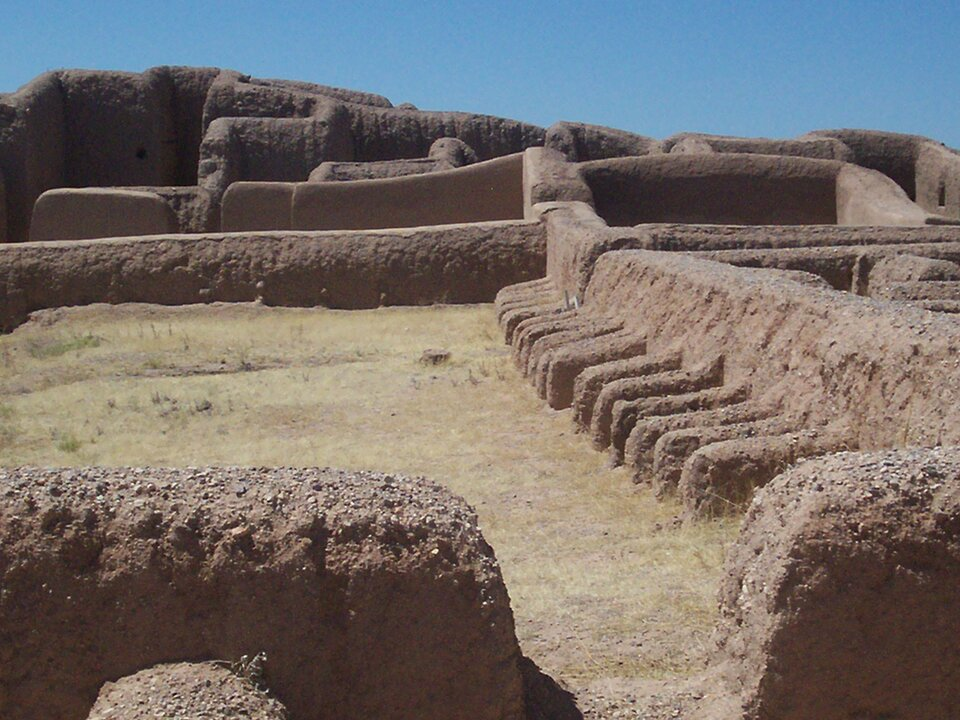
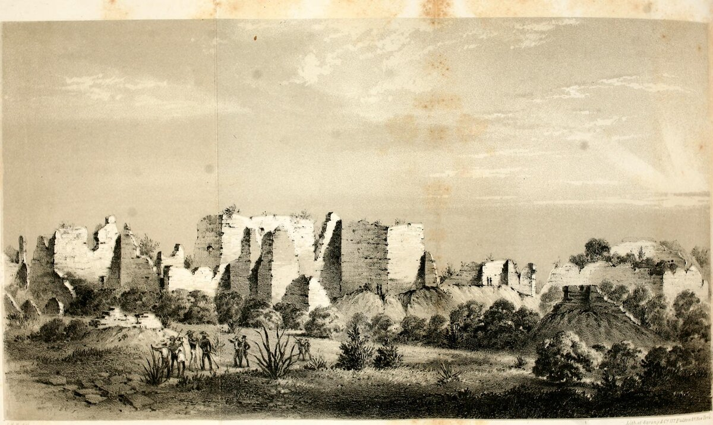

# 4. Переходная зона: север Мексики и юго-запад США

> **Статус:** черновик.

[Глава 3](03-slozhnye-obshchestva.md) оставила юго-запад нынешних США на
середине пути: какао и ара приходили туда с юга, но откуда именно и через чьи
руки, источники не говорят. Эта глава — о самих землях между Мезоамерикой и
севером: о пустынях, горах и плоскогорьях, которые сегодня поделены на север
Мексики и юго-запад США. До испанцев здесь были свои оросительные каналы,
свои большие поселения и свои кризисы. После испанцев здесь же империя,
подчинившая перед тем государство мешика (ацтеков), десятилетиями не
могла справиться с народами, у которых не было ни столицы, ни правителя,
которого можно взять в плен.

В главе два опорных тезиса конспекта. Тезис № 2 говорит, что регионы Америки
были связаны через цепочки посредников. Тезис № 6 — что мобильные
децентрализованные народы держались дольше: удар по центру не работает против
тех, у кого центра нет. Его прямая проверка на государствах Мезоамерики и
Анд — тема [главы 6](06-udar-po-centru.md); здесь — его вторая половина, о
тех, у кого центра не было.

Короткий итог проверки. Второй тезис для этой зоны приходится дополнить: связи
внутри самого юго-запада держали не только вещи, переходившие из рук в руки, но
и сами люди — целые общины переселялись за сотни километров, и на новых местах
появлялась посуда, по которой археологи видят эти связи. О связях с
Мезоамерикой источники главы почти ничего нового не говорят. Шестой тезис о
сроках подтверждается: войну с «чичимеками» испанцы вели больше сорока лет и
выиграть не смогли, а апачей (нде) и команчей (нумунуу) не покорили вовсе. Но
источники уточняют его в четырёх местах. Империя ответила на противника без
центра не победой, а «миром покупкой» — и дважды, с разницей в два века.
«Держаться дольше» не значит уцелеть: после мира кочевники первой
испанской границы, по выводу историка Хуана Карлоса Руиса Гвадалахары,
исчезли.[^ruizguadalajara2010] Конные набеги, которые кажутся вечным
свойством кочевников, отчасти были ответом на колонизацию: апачи, по историку
Мэтью Бэбкоку, стали конными налётчиками лишь во второй половине XVII
в.[^babcock2016] А оседлые пуэбло, у которых тоже не было
одного центра, сумели в 1680 г. выгнать испанцев на двенадцать
лет.[^hackett1911][^mcneil2021]

## Между Мезоамерикой и севером: понятия Кирхгофа

Слово [«Мезоамерика»](../glossary.md#мезоамерика) ввёл этнолог Пауль Кирхгоф.
В предисловии к переизданию 1960 г. он объяснял: статья 1943 г. пыталась
показать, что было общим у народов одной части материка и что отделяло их от
остальных, и для этого он перечислял только черты, свойственные исключительно
им, — поэтому в списке нет даже пирамиды.[^kirchhoff1960] Мезоамерика
Кирхгофа — картина на момент испанского завоевания: северная граница шла тогда
«более или менее от реки Пануко до Синалоа, через Лерму».[^kirchhoff1960] И
эта граница, по его словам, была куда подвижнее южной: на севере эпохи
продвижения Мезоамерики сменялись отступлениями, а большая полоса севера
Мексики в прежние времена входила в Мезоамерику.[^kirchhoff1960] С севера к
ней почти везде примыкали собиратели и охотники, и лишь на двух коротких
отрезках — земледельцы.[^kirchhoff1960]

Язык статьи — язык 1940-х гг. Кирхгоф делит народы Америки на «высших» и
«низших» земледельцев и собирателей, говорит о «племенах низшей культуры», а
засушливый север — «Большой Юго-Запад», или «засушливую Северную Америку», —
относит к «низшим» земледельцам.[^kirchhoff1960] Конспект берёт у него
географию, а не шкалу: слова «высший» и «низший» здесь описывают взгляд
автора, а не народы.

Два других названия появились позже. Мексиканская академия языка приводит
слова Кирхгофа из статьи 1954 г.: ещё в 1942 г. он отнёс весь север Мексики,
Нижнюю Калифорнию и Большой Бассейн к «Большому Юго-Западу», который тогда
же предложил называть *Arid America* («засушливая Америка»); а в статье 1954
г. была карта с тремя областями — *Arid America*, *Oasis America* и
*Meso-America*.[^kirchhoff1954][^aml-aridoamerica] Отсюда испанские
[«Аридоамерика» и «Оазисамерика»](../glossary.md#аридоамерика-и-оазисамерика):
земли собирателей и земли земледельческих «оазисов» юго-запада. Название
«Гран-Чичимека», то есть «Великая Чичимека», — колониальное: так, по историку
Хосе Рохасу Гальвану, в колониальную эпоху называли обширную область на
севере, где жили «чичимеки».[^rojasgalvan2016] Археолог Чарлз Ди Песо взял
его для заглавия своего отчёта о раскопках Пакиме.[^dipeso1974] Исследовательницы
Мари-Арети Эрс и Долорес Сото, на которых ссылается Руис
Гвадалахара, считают такие понятия, как «Гран-Чичимека» и «Север Мексики»,
упрощающими: они накрывают одним словом огромное и очень разное
пространство.[^ruizguadalajara2010]

Сам Кирхгоф в 1960 г. жаловался, что понятие «Мезоамерика» многие приняли, но
никто, насколько он знает, его конструктивно не критиковал и не
развивал.[^kirchhoff1960]

> [!NOTE]
> **Оценка конспекта.** Понятия Кирхгофа полезны как карта контраста — где
> около 1520 г. кончались земледельческие государства и начинались земли
> собирателей, — но не как граница. Сам он подчёркивал, что северный край
> Мезоамерики двигался, а между «оазисами» земледельцев и землями кочевников
> не было стены: и те и другие жили по соседству, торговали и воевали. Поэтому
> в конспекте «переходная зона» — не третья культурная область, а полоса
> переходов, которую нынешняя граница США и Мексики разрезает поперёк
> (рисунок 4.1).

<picture>
  <source media="(prefers-color-scheme: dark)" srcset="img/04-zones-dark.svg">
  
</picture>

**Рис. 4.1.** Понятия Кирхгофа и нынешняя граница. *Схема:* северный край
Мезоамерики — по описанию Кирхгофа (1943, переиздание 1960), названия
Аридоамерики и Оазисамерики — по статье 1954 г.; очертания областей
условные, граница США и Мексики — по подложке Natural Earth.

## До испанцев: каналы, Пакиме и уход с плато

### Хохокам: каналы пустыни

Хохокам — так археологи называют культуру центральной Аризоны примерно
700–1450 гг.[^nelson2010] По сводке Маргарет Нельсон и соавторов (2010),
это была крупнейшая сеть каналов в доколумбовой Северной Америке: больше 500 км
самотёчных каналов расходились по долине Солт-Ривер, и водой из них поливали,
возможно, до 650 км² полей.[^nelson2010] Каналами управляли объединения из
нескольких деревень, у каждого — свои главные каналы с общим водозабором;
тёплый климат и надёжная река давали, вероятно, два урожая в
год.[^nelson2010]

Каналы кормили не одну долину. К 1000 г., по той же сводке, около 190 деревень
имели площадки для игры в мяч, и вокруг общих обрядов на этих площадках
держалась большая сеть обмена: с орошаемых равнин в горы шли зерно и хлопок, с
гор вниз — дичь и сырьё.[^nelson2010] Около 1070 г. эта сеть резко
распалась.[^nelson2010] Почему, спорят: называют и разросшиеся выше по реке
новые каналы, которые могли отнять воду у соседей ниже, и врезание русла
реки Хила, оставившее водозаборы на сухом берегу, и беспорядки на северной
окраине, согнавшие людей с гор в долину.[^nelson2010] Население долины росло
примерно с 800 по 1350 г., а затем быстро пошло на убыль; в 1356–1384 гг.
сток реки вёл себя так, как не вёл пятьсот лет: очень высокие паводки
чередовались с маловодьем, и это могло разрушать водозаборы
каналов.[^nelson2010] В конце концов нижняя долина Солт-Ривер опустела
совсем.[^nelson2010] Почему водозабор так уязвим, показывает схема на рисунке 4.2.

<picture>
  <source media="(prefers-color-scheme: dark)" srcset="img/04-canals-dark.svg">
  
</picture>

**Рис. 4.2.** Как работает и как ломается самотёчный канал. *Схема:* профили
условные, без масштаба; числа и объяснения — из сводки Нельсон и соавторов
(2010), пересказанной выше. Третье объяснение распада — беспорядки на северной
окраине — с водой не связано, и схема его не показывает.

Само слово «хохокам» — предмет спора о названиях. Община акимел-оодхам на
Солт-Ривер пишет, что археологи взяли его из её языка: *huhugam* — так
оодхам называют всех ушедших предков, и это слово не привязано к какой-то
эпохе, а археологи сузили его до одной культуры.[^srpmic] Служба национальных
парков США, напротив, пишет на странице памятника Каса-Гранде, что «хохокам»
— не название народа и не слово ни одного из языков потомков, а строители
были предками оодхам, хопи и зуни.[^nps-cagr] В двух вещах обе стороны
сходятся: это не отдельный народ, и у него есть ныне живущие потомки.
Нация тохоно-оодхам прямо называет оодхам потомками
хохокам.[^ton2026] Самоназвания здесь говорят сами за себя: *O’odham* —
«люди», *Akimel O’odham* — «речные люди», *Tohono O’odham* — «люди пустыни»,
а «пима» — имя, которым их называли другие.[^srpmic]

Большой дом Каса-Гранде в долине Хилы, по описанию Службы
национальных парков, стоял около 1350 г., а около 1450 г. им перестали
пользоваться.[^nps-cagr] Название ему дал миссионер Эусебио Кино, побывавший
здесь в 1694 г.[^nps-cagr] Бэбкок упоминает, что по устной традиции оодхам и
данным археологии апачи, вероятно, участвовали в разрушении торгового центра
Каса-Гранде около 1400 г., и оговаривает, что это не установлено.[^babcock2016]
Каким этот дом можно видеть сегодня, показано на рисунке 4.3.

<picture></picture>

**Рис. 4.3.** Каса-Гранде сегодня. Большой дом в долине Хилы (Аризона), около
1350 г., под защитным навесом 1932 г.[^nps-cagr] *Фото:* Goldmoney10, Wikimedia Commons,
CC0, снимок уменьшен.[^goldmoney2024]

### Пакиме: местный центр с южными чертами

Южнее нынешней границы, на севере штата Чиуауа, лежит Пакиме (по-испански —
Касас-Грандес, «большие дома»). По описанию ЮНЕСКО, здесь около 2000
помещений из сырцового кирпича, а расцвет пришёлся на XIV–XV
вв.[^unesco1998] Джордж и соавторы относят Пакиме к 1250–1450 гг. и описывают
как поселение, где черты юго-запада — пуэбло из примыкающих друг к другу
комнат — соединились с площадками для игры в мяч, более обычными для
Мезоамерики; там же найдены загоны для ара на площадях, скорлупа яиц и
скелеты больше 300 красных ара.[^george2018] Разводили ли ара именно здесь,
как показано в [главе 3](03-slozhnye-obshchestva.md#чако-какао-и-ара--с-юга-но-не-простой-эстафетой),
прямыми свидетельствами пока не доказано.[^conrad2023] Ячейки, которые описывают
как загоны для ара, видны на рисунке 4.4.

Откуда взялся такой центр, спорят. Уже заглавие отчёта Ди Песо называет
Пакиме павшим «торговым центром Гран-Чичимеки».[^dipeso1974] Майкл Уэйлен
и Пол Миннис (2003) пишут, что в литературе всегда преобладали модели, которые
выводят этот центр из импульсов извне, и что они держатся на двух допущениях:
до Пакиме здесь было мало людей, и связи с прежними местными жителями почти не
было.[^whalen2003] Оба допущения они оспаривают по старым и новым данным и
настаивают на местном развитии центра.[^whalen2003]

<picture></picture>

**Рис. 4.4.** Пакиме сегодня. Ряд глиняных ячеек, которые описывают как загоны
для ара; прямых свидетельств разведения ара здесь пока нет.[^conrad2023] *Фото:*
DiSchamelrider, Wikimedia Commons, CC0, снимок уменьшен.[^dischamelrider2014]

### Уход с плато Колорадо: засуха, теснота и насилие

На засушливом плато Колорадо дерево в постройках сохраняется веками, и
[дендрохронология](../glossary.md#дендрохронология) даёт годы рубки балок.
Кайл Бочински и соавторы (2016) собрали 29 311 дат годичных колец из построек
1002 поселений за 500–1400 гг.[^bocinsky2016] Строили волнами, и волн
четыре — они совпадают с четырьмя периодами принятой у археологов
периодизации юго-запада («корзинщики III», «пуэбло I», «пуэбло II» и «пуэбло
III»). В каждой волне население росло и стягивалось в большие поселения, и
каждая такая пора роста, по выводу авторов, кончалась спадом урожайности по
климатическим причинам, который подрывал и согласие внутри
общества.[^bocinsky2016] В конце трёх последних волн растёт насилие, сильнее
всего — около 1145 и около 1285 г.[^bocinsky2016] С концом третьей волны,
около 1145 г., по их выводу, на большей части юго-запада
исчезает система «великих домов» с центром в Чако, а с ней — почти все её
обряды, связанные с Мезоамерикой.[^bocinsky2016] Конец последней, четвёртой, — около 1285 г. — сопровождался
массовым дальним уходом с севера и исчезновением длинного ряда привычных черт
жизни.[^bocinsky2016]

Почему опустело Меса-Верде? Долгое время ответ давала засуха: самую тяжёлую её
часть, 1276–1299 гг., дендрохронолог Эндрю Элликотт Дуглас в 1946 г. назвал
«Великой засухой».[^schwindt2016]
Дилан Швиндт и соавторы (2016) пересчитали население центральной части
Меса-Верде по 18 000 памятникам и получили картину
сложнее.[^schwindt2016] В 1225–1260 гг. здесь жили в среднем около 27 тыс. человек,
в 1260–1280 гг. — около 22 тыс., а через несколько лет после 1280 г. — никого;
значит, уход начался ещё до 1260 г., больше чем за пятнадцать лет до
«Великой засухи», и одна она конец Меса-Верде не объясняет.[^schwindt2016] Как
менялось население, показывает рисунок 4.5.

По их реконструкции, кризис подготовили засушливые первые десятилетия XIII
в.: люди продолжали прибывать в и без того густонаселённый край и
расселялись на окраинах, где урожай был ненадёжен.[^schwindt2016] В 1225–1260
гг. в двух частях края — окраинной Ховенуип и соседней Макэлмо — людей жило
намного больше, чем предсказывает для этих мест размер земли, где кукуруза
росла без полива, и соотношение людей и такой земли стало самым
неблагоприятным; тогда же поселения стягиваются к источникам воды, появляются
оборонительные постройки, и насилие с окраин, по выводу авторов,
расшатало всё общество.[^schwindt2016] Засуха лишь завершила уход, который уже
шёл, и, вероятно, усилила насилие; общество Меса-Верде распалось к 1285
г.[^schwindt2016] Большинство его жителей ушло на север долины Рио-Гранде,
где, по реконструкции Бочински и Колера (2014), с середины XII до
середины XIII в. условия для земледелия без полива были лучше, чем в
центральной части Меса-Верде, откуда шли переселенцы, а плато Пахарито служило
убежищем в засуху.[^schwindt2016][^bocinsky2014]

Работа Мартена Схеффера и соавторов (2021) добавляет к этому важное отличие.
Перед прежними переломами 500–1300 гг. ряды дат вырубки показывают признаки
того, что общества постепенно теряли устойчивость; а у последнего ухода с
севера таких внутренних признаков нет, и авторы объясняют его внешними
причинами — изменчивостью климата и внешним давлением со стороны других
людей.[^scheffer2021]

<picture>
  <source media="(prefers-color-scheme: dark)" srcset="img/04-mesaverde-dark.svg">
  
</picture>

**Рис. 4.5.** Население центральной части Меса-Верде и «Великая засуха».
*Данные:* оценки Швиндта и соавторов (2016), табл. 2 — сумма жителей
«общинных центров» и малых поселений; полоса — разброс оценки, по авторам;
даты засухи — там же.

Куда приходили уходившие, видно по посуде. Барбара Миллс и соавторы (2013)
свели данные больше чем о 4,3 млн черепков с 700 с лишним памятников и о
4800 с лишним обсидиановых предметах на западе юго-запада за 1200–1450
гг.[^mills2013] 1275–1325 гг. — время дальних переселений и стягивания людей в
большие деревни; переселенцы из района Каента на северо-востоке Аризоны в
1280-х гг. пришли в центральную Аризону, и расписную посуду саладо, по
осторожной формулировке авторов, первыми начали делать небольшие группы,
которых обычно считают этими переселенцами и их потомками, — уже на новом
месте; в XIV в. она разошлась по всему югу.[^mills2013] Сходство посуды
связывало поселения в среднем на 70–120 км, а часть связей — больше чем на 250 км, и
это при том, что ходили только пешком.[^mills2013] Большая южная сеть выросла
и в 1400–1450 гг. распалась, а две небольшие северные группы — хопи и зуни —
уцелели и существуют и сегодня.[^mills2013] Направления этих переселений — на
рисунке 4.6. Как древние культуры юго-запада
связаны с ныне живущими народами — пуэбло, оодхам, апачами и навахо, — можно
посмотреть в [графе
родословной](https://wesaix.github.io/abya-yala/visuals/genealogy/), в полосе
«Юго-запад, Большой Бассейн и север Мексики».

<picture>
  <source media="(prefers-color-scheme: dark)" srcset="img/04-migrations-dark.svg">
  
</picture>

**Рис. 4.6.** Дальние переселения конца XIII в. *Схема по тексту главы:* уход с
Меса-Верде — по Швиндту и соавторам (2016), условия на Рио-Гранде — по Бочински
и Колеру (2014), переселенцы из Каенты, посуда саладо и расстояния связей — по
Миллс и соавторам (2013); области условные, стрелки — направления, а не дороги;
положение точек ориентировочное.

> [!NOTE]
> **Оценка.** «Климат или конфликты?» — для Меса-Верде источники отвечают:
> и то и другое, и ещё теснота. Швиндт и соавторы заключают, что дело не в
> одном изменении климата, а в том, как оно наложилось на общество, где
> доступ к надёжной земле был неравным, а люди сильно зависели от
> кукурузы.[^schwindt2016] Для тезиса № 2 отсюда урок, знакомый по
> [главе 3](03-slozhnye-obshchestva.md#люди-а-не-только-вещи): дальние связи
> юго-запада держались не одной передачей вещей из рук в руки, но и самими
> переселенцами, которые на новом месте начинали делать посуду, расходившуюся
> потом на сотни километров. Это вывод конспекта из сопоставления источников.

> [!IMPORTANT]
> **Гипотеза.** Швиндт и соавторы упоминают, что накапливаются данные о
> кочевых охотниках на юго-западе ещё до окончательного ухода из Меса-Верде, и
> допускают, что поэтому северо-восточная окраина стала
> опасной.[^schwindt2016] Схеффер и соавторы среди того, что изменило ход
> последнего ухода, тоже называют «возможное давление групп
> охотников-собирателей», но оговаривают, что механизм пока понятен не до
> конца.[^scheffer2021] Кто были эти люди, ни те ни другие авторы не говорят.

## Чичимекская война: противник без центра

Около 1546 г. испанцы нашли серебро у Сакатекаса, далеко к северу от долины
Мехико, и столкновение с кочевыми народами, через земли которых пошли дороги к
рудникам, стало неизбежным.[^ruizguadalajara2010] По Руису Гвадалахаре
(2010), земли между отомийским владением Шилотепек, севером Мичоакана и
касканами — группами мезоамериканского корня на западе — стали к
середине XVI в. первой чётко очерченной границей христиан и
кочевников в Северной Америке.[^ruizguadalajara2010] Больше сорока лет насилия —
с 1549 по 1591 г. — получили название «войны чичимеков», и само это название,
пишет он, придумано испанцами.[^ruizguadalajara2010]

### Кто такие «чичимеки»

[«Чичимеки»](../glossary.md#чичимеки) — не самоназвание и не один народ.
Испанцы, по Руису Гвадалахаре, переняли у науа их взгляд на северных
соседей и наложили на него свою пару «цивилизация — варварство»; так
появились «дикари», «голые», «разбойники» испанских
документов.[^ruizguadalajara2010] За ярлыком стояли разные народы — пами,
гуамары, копусы, гуачичили и сакатеки, каждый со своими землями, которые
они защищали от чужих.[^ruizguadalajara2010] Кроме полуоседлых пами, все они
жили подвижно, сезонно обходя свои угодья; группы редко превышали двести
человек, а сколько всего было людей, неизвестно даже
приблизительно.[^ruizguadalajara2010] О них самих мы знаем почти только
то, что записали испанцы.

Руис Гвадалахара критикует и историков. Американский историк Филип Пауэлл,
чьи работы о Кальдере и этой войне (1951, 1952 и 1977 гг.) Руис называет
самыми влиятельными, а за ним и многие другие
описывали кочевников теми же словами, что испанцы XVI в., — «дикари»,
«варвары», — и видели в войне столкновение «цивилизации и дикости»; по
мнению Руиса, эти понятия надо объяснять, а не принимать за описание
действительности.[^ruizguadalajara2010]

### Почему не работал удар

Испанцам не на что было ударить. Кочевники жили в стоянках, которые испанцы
называли «ранчериями», и на сезоны уходили на скальные уступы гор, недоступные
для конных солдат; общались между собой дымовыми
сигналами.[^ruizguadalajara2010] За годы войны они переняли у противника всё
полезное: священник Хуан Алонсо Веласкес в 1582 г. доносил королю, что они
давно ездят верхом, держат собак как сторожей, пользуются захваченными
аркебузами и порохом, научились пасти скот и делают более тонкие стрелы,
пробивающие доспехи.[^ruizguadalajara2010] Он же писал, что победить их можно
только людьми их собственного народа.[^ruizguadalajara2010]

Война была и делом. Испанские ополченцы воевали за свой счёт в расчёте на
награду и окупали поход добычей, прежде всего продажей пленных; захват
женщин и детей, по Руису Гвадалахаре, и питал вражду, продлевая
войну.[^ruizguadalajara2010] Бригида фон Менц (2025) описывает этот промысел
на двух веках, 1570–1770 гг.: пленных северян разлучали с семьями, мужчин
отправляли в рудники, асьенды (крупные поместья) и мастерские, а женщин и детей увозили
далеко в услужение, вплоть до столицы, и торговля пленными была настоящим
делом.[^vonmentz2025]

### От войны к «миру покупкой»

Перелом связан с вице-королём маркизом де Вильяманрике, прибывшим в 1585 г.:
он решил, что главная причина затянувшейся войны — солдаты-работорговцы, и в
1586 г. запретил захватывать чичимеков.[^ruizguadalajara2010] Человеколюбия в
этом решении не было: беглые рабы становились осведомителями своих, а солдатам
вице-король разрешил убивать «разбойников» за награду в двадцать песо за
голову, женщин и мальчиков до двенадцати лет — захватывать и отправлять в
Мехико.[^ruizguadalajara2010] В 1588 г. он сделал общей политикой
[«мир покупкой»](../glossary.md#мир-покупкой) — то, что раньше удавалось
капитанам Мигелю Кальдере и Хуану Морлете: уговоры и подарки гуачичилям и
сакатекам.[^ruizguadalajara2010] Ещё в 1582 году Веласкес предлагал на первых
порах «давать им есть и одеваться», запретить лук и стрелы, дать в руки
мотыгу и научить делать кирпичи-сырцы и дома.[^ruizguadalajara2010]
Результаты 1586–1588 гг. убедили вице-короля тратить казну на снабжение
кочевников и на переселение к ним оседлых индейцев, как это сделали с
тлашкальтеками, — Руис Гвадалахара относит это к 1589–1590
гг.[^ruizguadalajara2010]

Сам Кальдера — сын испанского капитана и женщины-гуачичиль, говоривший на её
языке, — у Пауэлла стал символом примирения двух миров.[^ruizguadalajara2010]
Руис Гвадалахара с этим не согласен: Кальдера был не мостом к миру, а
испанским солдатом, который создавал условия для господства над
пограничьем, а его знание кочевников служило его карьере.[^ruizguadalajara2010]

### Тлашкальтеки на севере

Тлашкальтеки — союзники Кортеса в войне против мешика (о ней —
[глава 6](06-udar-po-centru.md)) — снова понадобились империи. По Рохасу
Гальвану, переговоры со знатью Тлашкалы о переселении 400 семей начались лишь в
конце 1590 г., а 14 марта 1591 г. вице-король Луис де Веласко-младший подписал
с ними «капитуляции» — так в испанской Америке называли договоры, по которым
корона поручала кому-либо определённое дело — по формуле, которую приводит
Рохас Гальван, *descubrir, poblar o rescatar*.[^rojasgalvan2016] Даты здесь у двух историков расходятся: Руис
Гвадалахара, как сказано выше, относит переселение тлашкальтеков к 1589–1590
гг., а у Рохаса Гальвана в конце 1590 г. переговоры только
начинаются.[^ruizguadalajara2010][^rojasgalvan2016] По
капитуляциям переселенцы и их потомки становились
навечно идальго, то есть дворянами, освобождались от дани и личных повинностей, получали землю,
которую нельзя было отнять, а знатные из них — право носить оружие и ездить
на осёдланном коне.[^rojasgalvan2016] По Сесилии Шеридан Прието (2001), эти
привилегии хотя бы на бумаге уравнивали тлашкальтеков с испанскими
конкистадорами и создали на границе необычный порядок, к которому пришлось
приспосабливаться и испанским колонистам: за службу на границе Тлашкала
выторговала себе особое положение.[^sheridan2001]

В начале июня 1591 г. первые колонисты вышли из монастыря в Тотолаке; по
переписи, сделанной в пути, это были 690 человек, состоявших в браке, 187
детей и 55 холостых и вдовых, а в дороге было около ста
повозок.[^rojasgalvan2016] Казна дала им деньги на повозки, быков и плуги и
по меньшей мере 4500 овец.[^rojasgalvan2016] Двадцать первого августа
Кальдера основал Колотлан, куда пришли сто семей; поселение разделили на
кварталы — тлашкальтекский (там же жили испанцы), чичимекский и
квартал пришлых.[^rojasgalvan2016] Другая колония 1591 г. встала у Сальтильо —
Сан-Эстебан-де-ла-Нуэва-Тласкала.[^rojasgalvan2016] Санта-Мария-де-лас-Паррас,
которую Рохас Гальван упоминает в одном ряду с ними, по Шеридан Прието
основали позже, в 1598 г., семьи из Сан-Эстебана.[^sheridan2001] Тлашкальтеки должны были служить
кочевникам образцом оседлой христианской жизни, «крёстными», по-испански
*madrineros*, — это тот же замысел, что стоит за
[редукцией](../glossary.md#редукция): собрать людей в поселения испанского
образца.[^rojasgalvan2016] Где встали колонии, показано на рисунке 4.7.

<picture>
  <source media="(prefers-color-scheme: dark)" srcset="img/04-chichimeca-dark.svg">
  
</picture>

**Рис. 4.7.** Чичимекская война и колонии тлашкальтеков. *Данные:* места и
даты — по Руису Гвадалахаре (2010), Рохасу Гальвану (2016) и, для Парраса
(1598 г.), Шеридан Прието (2001); подписи
народов — без границ, их земли известны лишь в общих чертах; край Мезоамерики —
по Кирхгофу, размыт; линии — направления переселения, а не дороги; положение
точек ориентировочное. Колотлан попадает в размытую полосу края: по словесному
описанию Кирхгофа («более или менее» от Пануко до Синалоа через Лерму) нельзя
сказать, по какую сторону края он лежал.

### Мир — и исчезновение

На первой северной границе, по Руису Гвадалахаре, война в 1591 г.
кончилась.[^ruizguadalajara2010] Но не везде: на северо-востоке, пишет
Шеридан Прието, столкновения испанцев с местными народами продолжались до XIX
в.[^sheridan2001] Мир открыл путь к новым рудникам: в 1592 году Кальдера нашёл
месторождение у будущего Сан-Луис-Потоси.[^ruizguadalajara2010] Но для
кочевников, по выводу Руиса Гвадалахары, выбор был только между
«цивилизацией» и истреблением — то есть между полным и насильственным
переделом их жизни и гибелью; исчезновение кочевников первой границы, пишет он,
до сих пор скрыто за словами испанских документов.[^ruizguadalajara2010]

> [!NOTE]
> **Оценка конспекта.** Чичимекская война — лучший довод за тезис № 6 о
> сроках: у противника не было столицы, и больше сорока лет войны не дали
> империи победы. Но и здесь срок объясняет не одно отсутствие центра. Оно
> объясняет, почему войну нельзя было кончить одним ударом: владения
> Мезоамерики, по Руису Гвадалахаре, вошли в испанскую монархию «за несколько
> лет», а кочевники стали одной из самых трудных задач.[^ruizguadalajara2010] А
> почему её не спешили кончать, объясняет выгода: ополченцы окупали походы
> продажей пленных, и это продлевало вражду, а всерьёз за север испанцы
> взялись лишь после серебра Сакатекаса. Война показывает и границу тезиса. Империя нашла другой рычаг —
> подарки, переселенцев и миссии, — и он сработал там, где не сработала
> война. Кочевники продержались дольше государства мешика, но как народы, по
> выводу Руиса Гвадалахары, не уцелели.[^ruizguadalajara2010] «Держаться
> дольше» и «уцелеть» — разные вещи, и тезис говорит только о первом.

## Миссии, пресидио и пленники

### Нью-Мексико: миссии и упадок пуэбло

Севернее, на Рио-Гранде, испанцы пришли к оседлым земледельцам.
[Пуэбло](../glossary.md#пуэбло) — испанское слово «селение» — так испанцы
называли и сами многоэтажные общинные дома, и их жителей; к 1680 г. пуэбло
Нью-Мексико (без хопи, живших западнее), по классификации историка Чарлза
Хэкетта (1911),
говорили на языках трёх разных семей, а каждый из их «народов», как говорили
испанцы, был практически независим.[^hackett1911] Летом 1598 года Хуан де Оньяте привёл около 400 человек, 130
из них с семьями, и в июле на собрании представителей тридцати четырёх
пуэбло объявил провинцию испанской.[^hackett1911] К 1630 г., по Хэкетту,
здесь служили пятьдесят монахов и стоял гарнизон в 250
солдат, а францисканец Алонсо де Бенавидес насчитывал больше 60 000
крещёных индейцев — число миссионера, заинтересованного в
успехе.[^hackett1911]

Насколько тяжело колонизация ударила по пуэбло и когда, хорошо видно на
провинции Хемес. Её жители, говорившие на языке това, первым испанцам
называли себя *Hemes*, пишут археологи Мэтью Либманн и Роберт
Преусел.[^liebmann2007] Либманн и соавторы (2016) оценили по развалинам
восемнадцати деревень, что около 1500 г. здесь жили около 5000–8000 человек; это
согласуется с записью монаха Херонимо Сарате Салмерона, служившего здесь в
1621–1626 гг.: он записал крещение 6566 «душ»; в таблице авторов эта запись
отнесена к 1621–1622 гг.[^liebmann2016] Большого упадка ни до первых
встреч с европейцами, ни в годы первых экспедиций 1541–1598 гг. источники не
показывают.[^liebmann2016] Обвал начался после того, как в 1620-х гг. сюда
пришли миссии, и шёл следующие два десятилетия: к 1630 г., по сообщению
Бенавидеса, от двух волн эпидемий, насилия и голода умерла половина жителей
и осталось около 3000 человек, а к 1644 г. — 1860.[^liebmann2016] Годы, когда
большие деревни опустели, авторы установили независимо от испанских записей —
по возрасту сосен, выросших на их развалинах: сосны начали расти там в
1630–1640-х гг., значит, жить в этих деревнях перестали не позже этого
времени.[^liebmann2016] К 1681 г. все оставшиеся жители провинции собрались в
одном селении, Патокуа; по оценке авторов по его развалинам, в начале 1680-х
гг. оно вмещало не больше 833 человек — и эта независимая от испанцев оценка
согласуется с их записями.[^liebmann2016] За 1620–1680 гг. население
сократилось примерно с 6500 до меньше чем 850 человек, то есть на 87%, а в
1694 г., по испанским военным журналам, жителей было меньше
600.[^liebmann2016] Все эти числа сведены на рисунке 4.8. Похоже было
и у зуни: по исследованию Сюзанны Эккерт, на которое ссылаются авторы, большой
упадок от эпидемий начался там после основания миссии в Хавикку в 1629
г.[^liebmann2016]

<picture>
  <source media="(prefers-color-scheme: dark)" srcset="img/04-jemez-dark.svg">
  
</picture>

**Рис. 4.8.** Население провинции Хемес до и после миссий. *Данные:*
Либманн и соавторы (2016): оценки по развалинам (около 1500 г. и начало
1680-х гг.) и числа испанских документов (1621–1622, 1630, 1644, 1694 гг.).

Причины здесь — болезни вместе с насилием и голодом; об эпидемиях во всей
Америке пойдёт речь в [главе 5](05-epidemii.md). Для этой главы важна дата:
упадок пришёл не с первыми встречами, а с постоянной колонией и миссиями —
почти через век после первой встречи с испанцами в 1541 г., — и большие
деревни опустели за сорок–пятьдесят лет до восстания 1680 г.[^liebmann2016] Гипотезу, по
которой край опустел ещё до первых прямых встреч — от эпидемий, пришедших из
центральной Мексики в 1520–1530-х гг., — Либманн и соавторы для Хемеса прямо
отвергают.[^liebmann2016] Поэтому Хемес —
контрпример к тезису № 3 конспекта, что эпидемии во многом предшествовали
завоеванию: здесь убыль пришла не впереди колонистов, а вслед за ними. Это
вывод конспекта по одной провинции; насколько он верен для других мест — вопрос
главы 5.

### Пленники в обе стороны

Апачи поначалу отнеслись к испанцам вовсе не так, как велит привычный образ.
Бэбкок (2016) пишет о них как о нде (*Ndé*), а слово «апачи» выводит, скорее
всего, из зуньийского *ápachu* — «враг», так зуни называли навахо, которых
Бэбкок зовёт дине («люди»); само имя «навахо» — тевское слово, означающее
«большие возделанные поля».[^babcock2016] До прихода испанцев, по Бэбкоку,
большинство апачей жили не кочевниками, а полуоседло: сочетали небольшие поля
кукурузы, дынь и тыкв с охотой и собирательством, и у каждой группы были свои
земли вокруг полей, хотя ходили они много — на охоту, торговать, к родне и на
войну.[^babcock2016] Он напоминает, что Санаба, вождь чихене — нде
юго-запада нынешнего Нью-Мексико, — в 1620-х гг. принял крещение и сам
проповедовал своим людям, а охотники на бизонов восточнее Рио-Гранде, которых испанцы
звали апачами-«вакеро», обещали креститься — пока губернатор
Нью-Мексико не приказал захватывать их в плен для продажи в
рабство.[^babcock2016] Губернаторы и их союзники продавали пленных апачей в
рудники, дома и на поля у Парраля с 1630-х по 1670-е
гг.[^babcock2016] По выводу Бэбкока, до 1660-х гг. отношения нде с соседями
были в основном мирными, они мстили за набеги работорговцев, а самая тяжёлая
война шла между испанцами и навахо.[^babcock2016] Только в
годы засухи, голода и болезней 1667–1672 гг. нде начали чаще нападать на
миссии и селения, а верхом — по меньшей мере с 1671 г.[^babcock2016]

Торговля людьми шла и в обратную сторону. Хоакин Ривайя Мартинес (2025)
пишет, что команчи и испанцы брали пленных по сходным причинам, в основном
ради их труда, и обе стороны на этом
наживались.[^rivayamartinez2025] В Нью-Мексико шли «ярмарки выкупа», где
кочевники продавали пленных, а потомков таких пленных стали звать
[генисаро](../glossary.md#генисаро).[^rivayamartinez2025] В 1770-х гг., по
описанию монаха Атанасио Домингеса, девушку 12–20 лет на ярмарке в Таосе
выкупали за двух хороших коней или мула и немного ткани и безделушек, юношу —
намного дешевле.[^rivayamartinez2025] А испанцы, в свою очередь, отправляли
пленённых «варваров» очень далеко — чтобы те не вернулись к
своим.[^rivayamartinez2025] Слово «варвары», по-испански *indios bárbaros*, Ривайя Мартинес
оговаривает особо: так испанцы называли всех некрещёных и независимых
индейцев.[^rivayamartinez2025]

### Пресидио

Ответом империи на набеги стали [пресидио](../glossary.md#пресидио) —
пограничные крепости с гарнизонами — и [миссии](../glossary.md#миссия) рядом с
ними. В 1748 г. власти Новой Бискайи — испанской провинции на севере
нынешней Мексики — объявили апачам всеобщую войну.[^babcock2016] Королевский регламент 1772 г. выстроил «линию» из
пятнадцати пресидио — от Альтара в Соноре через Тубак, Ханос и Эль-Пасо до
Баия-дель-Эспириту-Санто в Техасе, примерно в сорока лигах одно от
другого.[^reglamento1772] Лига — испанская мера пути, примерно 4–5
км,[^babcock2016] так что крепости отстояли друг от друга, грубо говоря, на
170–200 км. Мир с апачами регламент заключать запрещал: капитаны
могли дать лишь перемирие под заложников, пока его не одобрят инспектор и
вице-король, а условием перемирия ставили обмен пленными.[^reglamento1772]

## Восстание пуэбло 1680 г.

### Причины

Хэкетт, разобравший в 1911 г. испанские судебные акты о восстании, на первое
место ставил попытки миссионеров и властей подавить не только веру, но и
весь уклад пуэбло; между 1645 и 1675 гг. было несколько попыток восстать, и
все их подавили.[^hackett1911] Археологи Либманн и Преусел (2007) пишут, что
испанские документы выставляют восстание случайной вспышкой и умалчивают о
долгом сопротивлении пуэбло экономическому гнёту и преследованию их веры, а
это преследование особенно ужесточилось в двадцать лет перед
1680 г.[^liebmann2007] В 1675 г. губернатор Тревиньо схватил сорок семь
религиозных лидеров пуэбло — у Хэкетта они «medicine men», «знахари», —
обвинив их в колдовстве, троих повесил, а остальных наказал; среди них был
Попе (сегодня его имя пишут По’пай, *Po’pay*) из пуэбло Сан-Хуан,
освобождённый, когда за арестованными в Санта-Фе пришли
воины-тева.[^hackett1911][^liebmann2007] Сан-Хуан сегодня
носит своё имя — Окай-Овинге.[^fr2008] Линда Макнил (2021) называет одной
из главных причин и дань маисом и тканями по
[энкомьенде](../glossary.md#энкомьенда), и трудовые повинности середины XVII
в.[^mcneil2021] К этому добавились засуха, голод и болезни конца 1660-х гг. и
то обвальное падение численности, которое видно на
Хемесе.[^babcock2016][^liebmann2016] Его показывает рисунок 4.8.

### Ход

К 1680 г. в Нью-Мексико, по подсчёту Хэкетта, жили около 2800 испанцев, служили
тридцать два францисканца, а крещёных индейцев было около 16 000 — вчетверо
меньше, чем 60 000 с лишним у Бенавидеса полувеком раньше, хотя его число,
как сказано выше, могло быть завышено.[^hackett1911] Попе, перебравшийся в Таос, разослал по пуэбло верёвку с
узлами: число узлов показывало, сколько дней осталось до выступления, и
назначенным днём, по Хэкетту, было 11 августа.[^hackett1911] Девятого августа
заговор раскрыли, и восставшие выступили раньше — на рассвете 10
августа.[^hackett1911] Убито было больше 380 испанских мужчин, женщин и
детей вместе со слугами, а кроме того восемнадцать священников, два монаха и
настоятель церкви Санта-Фе.[^hackett1911] Уцелевшие собрались в Санта-Фе и в
Ислете; в Ислете их было около полутора тысяч, из них лишь 120 способных носить
оружие; Ислета в восстании не участвовала, а пиро остались на стороне
испанцев.[^hackett1911] Испанские архивы за 1598–1680 гг. восставшие сожгли на
площади Санта-Фе.[^hackett1911] В конце сентября беженцы дошли до переправы
через Рио-Гранде у монастыря Гуадалупе, где и осели; отсюда, по Хэкетту,
начинается настоящая история гражданских и военных поселений вокруг
Эль-Пасо.[^hackett1911] Где это происходило, показано на рисунке 4.9.

Хэкетт пишет по испанским актам, и это видно: о Попе он сообщает со слов
свидетелей, что тот приписывал себе связь с духами, а об убийствах — то, что
«не уставали повторять» испанцы.[^hackett1911] Голос самих пуэбло в этих
документах слышен в основном через показания пленных. Либманн и Преусел
замечают, что почти все истории восстания построены на тех же испанских
военных журналах и письмах монахов: пуэбло говорят в них лишь через
европейских посредников и переводчиков, а испанские авторы оправдывали своё
поражение и будущее возвращение.[^liebmann2007] Но память о восстании хранят
и устные предания самих пуэбло — их записывали ещё в XIX в. и рассказывают
сегодня; в 1980 г., к трёхсотлетию восстания, бегуны пуэбло пронесли от Таоса
до хопи шнур с узлами в память о гонцах 1680 г.[^liebmann2007]

<picture>
  <source media="(prefers-color-scheme: dark)" srcset="img/04-revolt-dark.svg">
  
</picture>

**Рис. 4.9.** Восстание пуэбло: 1680 г. и после. *Схема по тексту главы:* места и
даты — по Хэкетту (1911), Либманну и Преуселу (2007) и Бэбкоку (2016); пуэбло —
точками, без границ земель; стрелки — направления, а не дороги; положение точек
ориентировочное.

### Союзники и возвращение испанцев

Восставшие были не одни. Бэбкок называет события 1680-х гг. войной пуэбло, дине
и нде за независимость: апачи принимали беглецов из миссий, помогали восставшим
и нападали на индейцев — союзников испанцев.[^babcock2016] Когда в конце 1681
г. губернатор Антонио де Отермин впервые попытался вернуть провинцию,
испанцы с удивлением нашли пуэбло «в союзе и в мире с апачами»; рассказы
пуэбло о том, что во всём виноваты апачи, Бэбкок советует принимать с большой
осторожностью — их было безопаснее рассказывать испанцам.[^babcock2016] В
декабре 1681 г. верхом были лишь немногим больше десятой части из примерно
тысячи восставших, которых встретил испанский отряд, но и этих хватило:
конный отряд пуэбло и апачей во главе с Луисом Тупату из Пикуриса заставил
Отермина отступить.[^babcock2016] До 1692 г. испанцы, по Либманну и
Преуселу, оставались в изгнании и заходили в провинцию лишь короткими
вылазками.[^liebmann2007] В 1683–1684
гг. восстания перекинулись на юг — к рудникам Парраля и на миссии у Ханоса,
Касас-Грандеса и Эль-Пасо.[^babcock2016]

Вернулись испанцы в Нью-Мексико лишь с походом Диего де Варгаса, начавшимся в
1692 г., а в 1696 г. пуэбло восстали снова.[^mcneil2021] Держались пуэбло не
все вместе: Сия, Санта-Ана и Сан-Фелипе, по Либманну и Преуселу, в 1690-х гг.
встали на сторону возвращавшихся испанцев.[^liebmann2007] В октябре 1696 г. жители
Санта-Клары и Пикуриса ушли от Варгаса на равнины, к своим союзникам-апачам в
Эль-Куартелехо, и большинство прожило там около
десяти лет.[^babcock2016] Их путь тоже есть на рисунке 4.9.

Восстание — мост к [главе 7](07-loshad-i-ruzhyo.md): после него лошади
быстрее расходились по равнинам. Но не оно положило этому начало: восточные
нде, по Бэбкоку, к началу 1640-х гг. уже покупали лошадей у жителей Нью-Мексико, в
том числе у самого губернатора.[^babcock2016]

> [!NOTE]
> **Оценка конспекта.** Пуэбло — проверка тезиса № 6 с другой стороны. У них
> тоже не было одного центра, но они были оседлы, и в 1598 г., по Хэкетту,
> испанская власть установилась быстро.[^hackett1911] Значит, «нет центра» само по себе от подчинения не
> спасает. Зато отсутствие центра не помешало им договориться между собой: о
> дне восстания многие самостоятельные селения условились верёвкой с узлами.
> Восставшим помогали союзники вне досягаемости испанцев — апачи, к которым
> можно было уйти на равнины. Можно предположить — это гипотеза конспекта, а
> не вывод источников, — что успех восстания держался и на таких союзниках.
> Проверить её на материале главы нельзя: у «чичимеков» тоже было куда
> уходить, и они всё же исчезли, а сравнения пуэбло, восставших удачно и
> неудачно, в источниках главы нет.

## Второй «мир покупкой»: апачи, команчи и Мексика

### Команчи

Команчи — *Numunuu*, «наши люди», — появляются в испанских документах в 1706
г.[^rivayamartinez2025] Они пришли с территории нынешнего Вайоминга и в конце
XVII в., по-видимому получив первых лошадей, двинулись на юг по
равнинам.[^rivayamartinez2025] В 1770-х гг. их набеги на Нью-Мексико
участились — отчасти из-за долгой засухи на южных
равнинах.[^rivayamartinez2025] Летом 1779 г. губернатор Хуан Баутиста де Анса
повёл поход в глубь земель команчей: убиты 65 команчей, в том числе их вождь
Куэрно Верде, 34 взяты в плен, захвачено больше 500
лошадей.[^rivayamartinez2025] После эпидемии оспы 1780–1781 гг. восточные
команчи заключили мир в Техасе в 1785 г., западные во главе с Экуэракапой —
в Нью-Мексико в 1786 г., а в апреле 1787 года Анса скрепил мир с
представителями всех четырёх частей народа.[^rivayamartinez2025] Как команчи
стали самостоятельной силой на равнинах, — тема глав
[7](07-loshad-i-ruzhyo.md) и [8](08-epoha-balansa.md).

### Инструкция Гальвеса: «худой мир»

Двадцать шестого августа 1786 г. вице-король Бернардо де Гальвес отправил
командующему Внутренними провинциями — северными пограничными землями Новой
Испании под общим военным началом — Хакобо Угарте-и-Лойоле инструкцию, которая
сделала «мир покупкой» политикой и для апачей.[^galvez1786] В статье 29 он пишет:
«Я твёрдо уверен, что победа над язычниками состоит в том, чтобы втянуть их в
истребление друг друга», и тут же, что в нынешнем положении провинций «нам
будет выгоднее худой мир со всеми народами, которые его попросят, чем усилия
доброй войны», по-испански *una mala paz… que los esfuerzos de una buena
guerra*.[^galvez1786] В следующей статье он напоминает, что империю мешика
завоевала не большая испанская армия, а помощь тлашкальтеков и других
индейцев.[^galvez1786]

Дальше Гальвес объясняет, как держать «худой мир». Индейцам можно давать в
обмен на шкуры лошадей, мулов, скот, сушёное мясо, сахар, маис, табак,
спиртное и ружья; апачи спиртного не знают, но к нему их «следует
приучить»: это расположит их, развяжет им языки, усыпит их враждебность и
создаст «новую потребность», которая заставит их признать «нашу неизбежную
зависимость».[^galvez1786] Ружья для обмена должны быть длинными, с непрочными
стволами и замками, чтобы их приходилось то и дело чинить у испанцев, а порох
— щедро раздаваться, чтобы индейцы забыли лук: тогда в случае войны им не
хватит боеприпасов, и они сами вернутся просить
дружбы.[^galvez1786]

Это сработало — на время. По Бэбкоку, после 1786 г. уставшие от войны и не
доверявшие друг другу апачи и испанцы пришли к компромиссу, который дал больше
четырёх десятилетий непрочного мира; из-за засухи и военного давления тысячи
апачей поселились у пресидио — в «поселениях мира», *establecimientos*, от
Ларедо до Тусона.[^babcock2016] Бэбкок называет их самыми ранними и самыми
обширными в Америке резервациями под управлением военных и образцом для
будущих [резерваций](../glossary.md#резервация--резерв) США.[^babcock2016] Оба
«мира покупкой» на шкалах времени — на рисунке 4.10.

<picture>
  <source media="(prefers-color-scheme: dark)" srcset="img/04-peace-dark.svg">
  
</picture>

**Рис. 4.10.** Дважды «мир покупкой»: конец Чичимекской войны и мир с апачами и
команчами. *Схема по данным:* даты — по источникам, указанным в тексте главы;
конец «поселений мира» показан размыто — Бэбкок даёт срок «больше четырёх
десятилетий», а Делей — «почти два поколения» мира до начала 1830-х гг.;
конец набегов не показан — источники главы его не называют. Шкалы в разном
масштабе.

### Мексика и «война тысячи пустынь»

Мексика стала независимой в 1821 г.[^rivayamartinez2025] «Войной тысячи
пустынь» историк Брайан Делей назвал свою книгу (2008) о набегах на север
Мексики.[^delay2008] По его статье 2007 г., в начале 1830-х гг., после почти двух поколений несовершенного мира,
команчи, кайова, навахо и несколько групп апачей резко участили набеги на
мексиканские поселения; за этим стояли ослабление мексиканской армии и
дипломатии и растущие рынки для угнанного скота и
пленных.[^delay2007] Набеги и ответные походы охватили целиком или частично
девять мексиканских штатов, унесли тысячи жизней, разорили важные отрасли
хозяйства севера и опустошили его сельскую местность; к 1846 г. северяне
были истощены, бедны и расколоты и не могли противостоять армии
США.[^delay2007] В описании книги Делея (2008) штатов уже десять, а на месте
процветавших селений остались «рукотворные пустыни»; эта война, по Делею,
подкрепила в США доводы за захват мексиканской земли.[^delay2008] О масштабе
говорят и тогдашние известия: в начале 1841 г. в Мехико рассказывали о набеге
команчей на Сальтильо, где будто бы угнали 1600 лошадей, увели два десятка
пленных и убили 102 мексиканца.[^delay2007b]

Войну закончил договор, подписанный 2 февраля 1848 г. в Гуадалупе-Идальго;
США ратифицировали его 10 марта, Мексика — 30 мая.[^tratado1848] Вместе с
Техасом США получили в эти годы, по описанию книги Делея, половину
национальной территории Мексики.[^delay2008] Его статья XI говорит языком эпохи: на
отходящих к США землях живут «дикие племена», в испанском тексте *tribus salvages*, и
правительство США обязуется силой сдерживать их набеги на Мексику, а жителям
США запрещено покупать захваченных индейцами пленных и угнанный скот и
продавать индейцам оружие.[^tratado1848] Обязательство продержалось недолго.
Договор Гадсдена провёл новую границу: Мексика уступила США полосу к югу от
прежней (статьи I и IV), а США освободились от статьи XI, которая была
отменена (статья II); за то и другое вместе США заплатили десять миллионов
долларов (статья III).[^gadsden1853] Подписан он был 30 декабря 1853 г., а в силу вступил
в 1854 г.: Сенат США одобрил его с поправками, и 30 июня 1854 г., в день
обмена ратификациями, президент провозгласил договор.[^gadsden1853]

## Граница поперёк земли оодхам

Новую границу проводила совместная комиссия; комиссаром от США был
назначен Джон Расселл Бартлетт.[^bartlett1854] Путешествуя вдоль будущей
границы в 1850–1853 гг., он побывал и в Касас-Грандесе — и среди рисунков его
книги есть литография развалин Пакиме.[^bartlett1854] Она воспроизведена на
рисунке 4.11.

<picture></picture>

**Рис. 4.11.** Пакиме глазами комиссии по границе. «Развалины в
Касас-Грандесе, Чиуауа» — литография из книги
Джона Расселла Бартлетта, комиссара США по проведению границы (1854, второй том,
фронтиспис). *Первоисточник:* общественное достояние; скан Internet Archive
Book Images, Wikimedia Commons; изображение уменьшено.[^bartlett1854]

Граница, проведённая по договорам 1848 и 1853 гг., пересекла земли, где
оодхам жили задолго до неё (рисунок 4.12). Община акимел-оодхам и пиипааш (марикопа) вспоминает, что покупка
Гадсдена отдала США долину Хилы с их деревнями, и тогда это ещё не казалось
угрозой их самостоятельности.[^srpmic] Нация тохоно-оодхам пишет, что граница,
установленная покупкой Гадсдена в 1854 г., разделила её земли и многие семьи;
сегодня её земли примерно на 100 км (62 мили) прилегают к границе США и Мексики, у нации
больше 37 000 членов, и около 3000 из них по-прежнему живут на родовых землях в
Соноре.[^ton2026] Люди пересекают границу часто, иногда каждый день: к родным,
по делам, к святым местам, а паломники до сих пор ходят пешком к
Калифорнийскому заливу за солью и раковинами.[^ton2026] Резервация нации — около 1,1
млн га (2,8 млн акров), вторая по величине в США, но это лишь часть родовых земель,
которые простирались от центральной Аризоны до
Соноры.[^ton2026]

<picture>
  <source media="(prefers-color-scheme: dark)" srcset="img/04-border-dark.svg">
  
</picture>

**Рис. 4.12.** Граница поперёк земли оодхам; *схема:* линии условные. По статье
V договора 1848 г. граница шла вверх по Рио-Гранде до южной границы
Нью-Мексико, по ней на запад, затем на север до первого рукава Хилы и по Хиле до
Колорадо; южную и западную границы Нью-Мексико договор берёт с карты 1847
г.[^tratado1848] Поэтому эти два отрезка нарисованы условно, а отрезок по Хиле —
по линии реки (Natural Earth). Новую линию — по 31°47′ и 31°20′ с. ш., затем к
Колорадо — описывает статья I договора Гадсдена; на рисунке это нынешняя
граница по подложке Natural Earth.[^gadsden1853] Земли тохоно-оодхам — размытым
пятном, без границ.

## Вывод

Переходная зона оказалась не окраиной двух миров, а местом, где многое
решалось по-своему. До испанцев здесь была крупнейшая в доколумбовой Северной Америке
сеть каналов, большой центр Пакиме, который Уэйлен и Миннис (2003) объясняют
местным развитием, а не «форпостом» юга, и кризисы, которые не сводятся к одной засухе:
Меса-Верде начало пустеть раньше «Великой засухи», а распад сетей хохокам и
юга в целом растянулся на века. Связи внутри юго-запада держались и вещами, и
людьми: переселенцы на новых местах начинали делать посуду, которая
расходилась потом на сотни километров. В этой части тезис № 2 не опровергнут,
а расширен — как и в главе 3. Но переселения внутри юго-запада — не связи
между большими регионами. О том, как были связаны Мезоамерика и юго-запад,
источники этой главы почти молчат, и вопрос, оставленный главой 3, — откуда и
через чьи руки шли на север какао и ара, — остаётся открытым.

Тезис № 6 источники подтверждают в той части, которая говорит о сроках, и
уточняют в остальном. Испанцы больше сорока лет не могли победить «чичимеков» и так и
не покорили ни апачей, ни команчей. Но и сроки объясняет не одно отсутствие
центра: войну с «чичимеками», по Руису Гвадалахаре, продлевала и выгода от
продажи пленных, а за север испанцы всерьёз взялись лишь после серебра
1546 г. — это оценка конспекта. Ответом на противника без центра стала
не победа, а «мир покупкой» — подарки, переселенцы, миссии, а через два века
спиртное и нарочно непрочные ружья; первый раз он, по выводу Руиса
Гвадалахары, привёл к исчезновению кочевников первой границы, второй — к
поселениям у пресидио, которые Бэбкок называет первыми резервациями под
управлением военных. Подвижность и конные набеги — не одно и то же: до
испанцев большинство нде, по Бэбкоку, жили полуоседло, сочетая поля с охотой и
дальними переходами, а конными налётчиками стали лишь во второй половине XVII
в., в ответ на набеги работорговцев, голод и войну. А
оседлые пуэбло без единого центра колонию в 1598 г. не остановили, но в 1680 г.
выгнали испанцев на двенадцать лет — вместе с союзниками-апачами.

| Утверждение | Что показывают источники | Итог |
|---|---|---|
| Связи — через посредников (тезис № 2) | Дальние связи внутри юго-запада держали и переселенцы: посуда саладо на юге, уход с Меса-Верде на Рио-Гранде; о связях с Мезоамерикой источники главы почти молчат | внутри юго-запада расширяется: посредниками были и сами переселенцы; для связей с Мезоамерикой — открытый вопрос |
| Удар по центру не работает против тех, у кого центра нет (тезис № 6) | «Чичимеков» не победили больше чем за сорок лет войны, апачей и команчей не покорили; войну продлевала и выгода от продажи пленных | подтверждается для сроков, но срок объясняет не одно отсутствие центра |
| Мобильные народы держатся дольше | Кочевники первой границы после «мира покупкой» исчезли; апачи пережили империю | «дольше» ≠ «уцелели» |
| Мобильность — исходное свойство | До испанцев большинство нде жили полуоседло, с полями и своими землями; до 1660-х гг. отношения с соседями в основном мирные; лошадей покупают к 1640-м, конные набеги — по меньшей мере с 1671 г. (Бэбкок) | подвижность была, конные набеги — отчасти ответ на колонизацию |
| Нет центра — нет подчинения | В 1598 г. испанская власть над пуэбло установилась быстро, но в 1680 г. они договорились и победили | гипотеза конспекта: много значили союзники вне досягаемости испанцев; источниками главы не проверена |

Что может измениться. Население Меса-Верде и даты распада сетей
пересчитываются с каждой новой серией дат: работы 2013–2021 гг., на которых
стоит этот раздел, уже поправили прежнюю картину «засуха — и всё». Разводили ли
ара в Пакиме, по данным 2023 г. остаётся без прямых свидетельств. О кочевых
охотниках у Меса-Верде пока есть лишь намёки. И почти всё о «чичимеках»
известно только из испанских документов.

Дальше, в [главе 5](05-epidemii.md), — о болезнях, которые, как на Хемесе,
шли рядом с колонизацией. [Глава 6](06-udar-po-centru.md) проверит тезис № 6 на
другой стороне: там испанцы как раз нашли центр и ударили по нему. В
[главе 7](07-loshad-i-ruzhyo.md) — о том, как лошади, которые нде и пуэбло
знали задолго до 1680 г., изменили жизнь равнин.

## Источники

[^kirchhoff1960]: Kirchhoff 1960, предисловие ко второму изданию и разд. «Límites geográficos y composición étnica», «Límites de Mesoamérica a mediados del siglo XVI» (полный текст, цифровая копия; номера страниц копии не совпадают с изданием).
[^kirchhoff1954]: Kirchhoff 1954 (только описание; содержание — по цитате в справке Мексиканской академии языка).
[^aml-aridoamerica]: Academia Mexicana de la Lengua, «¿Se dice Aridoamérica o Aridamérica?» (полный текст).
[^dipeso1974]: Di Peso 1974, заглавие (только описание).
[^ruizguadalajara2010]: Ruiz Guadalajara 2010, с. 24–25, 27–28, 35–37, 40–43, 50–55 (полный текст, открытый доступ).
[^nelson2010]: Nelson et al. 2010, аннотация и разд. о хохокам (полный текст, открытый доступ).
[^srpmic]: Salt River Pima-Maricopa Indian Community, страницы «Onk Akimel O’odham» и «Timeline of O’odham Piipaash History» (полный текст).
[^nps-cagr]: National Park Service, Casa Grande Ruins, «History & Culture» (полный текст).
[^ton2026]: Tohono O’odham Nation 2026, «Issue Brief: Background» (полный текст).
[^unesco1998]: UNESCO World Heritage Centre, Archaeological Zone of Paquimé, Casas Grandes, описание объекта (полный текст).
[^george2018]: George et al. 2018, введение (полный текст, PMC6126748).
[^conrad2023]: Conrad et al. 2023, аннотация и введение (полный текст, PMC10263259).
[^whalen2003]: Whalen & Minnis 2003, аннотация (только аннотация).
[^bocinsky2016]: Bocinsky et al. 2016, аннотация, разд. «Building the model», «Discussion» (полный текст, PMC4820384).
[^schwindt2016]: Schwindt et al. 2016, введение, табл. 2, разд. «Population Size and Movement», «Conclusions» (полный текст, PMC7523884).
[^bocinsky2014]: Bocinsky & Kohler 2014, разд. «Results» (полный текст, открытый доступ).
[^scheffer2021]: Scheffer et al. 2021, аннотация и «Discussion» (полный текст, PMC8106319).
[^mills2013]: Mills et al. 2013, введение, «Results and Discussion», «Conclusions» (полный текст, PMC3625298).
[^vonmentz2025]: Von Mentz 2025, аннотация (полный текст, открытый доступ).
[^rojasgalvan2016]: Rojas Galván 2016, с. 65, 70–75 и прим. 11 (полный текст, открытый доступ).
[^hackett1911]: Hackett 1911, с. 97–100, 104–106 и разд. о Ислете и об отступлении (полный текст, общественное достояние).
[^fr2008]: Federal Register 73 FR 18553, 4 апреля 2008 г. (полный текст).
[^liebmann2016]: Liebmann et al. 2016, табл. 1, разд. «Results», «Discussion», «Implications» (полный текст, PMC4760783).
[^liebmann2007]: Liebmann & Preucel 2007, рукопись авторов в Harvard DASH, с. 1–3, 7, 9, 12, 16–17 по нумерации рукописи (полный текст; страницы журнала не совпадают).
[^sheridan2001]: Sheridan Prieto 2001, с. 27 и прим. 33, с. 28, 30, 37 (полный текст, открытый доступ).
[^babcock2016]: Babcock 2016, описание книги и гл. 1, с. 19–33 и прим. 2 на с. 49 (гл. 1 — полный текст на сайте издательства; книга в целом — только описание).
[^rivayamartinez2025]: Rivaya Martínez 2025, с. 466–467, 472, 476–477 (полный текст, открытый доступ).
[^reglamento1772]: Reglamento 1772, «Instrucción para la nueva colocación de presidios», п. 1, и раздел об отношении к индейцам (полный текст, переиздание 1834 г.).
[^mcneil2021]: McNeil 2021, аннотация и обзорные разделы (полный текст, открытый доступ).
[^galvez1786]: Gálvez 1786, с. 1, ст. 29–30 (с. 11), 62–67 (с. 19–20), 71 и 76–78 (с. 21–23) (полный текст, по изображениям страниц).
[^delay2007]: DeLay 2007, с. 35–36 (фрагмент: начало статьи).
[^delay2007b]: DeLay 2007b, с. 83 (фрагмент: начало статьи).
[^delay2008]: DeLay 2008, заглавие и описание книги (только описание).
[^tratado1848]: Tratado de Guadalupe Hidalgo 1848, титульный лист, ст. V и XI (полный текст).
[^gadsden1853]: Gadsden Purchase Treaty 1853, ст. I–III (полный текст, Avalon Project).
[^bartlett1854]: Bartlett 1854, т. 1, гл. 1; т. 2, список иллюстраций и фронтиспис (полный текст).
[^dischamelrider2014]: DiSchamelrider 2014, фотография на Wikimedia Commons: описание и лицензия на странице файла.
[^goldmoney2024]: Goldmoney10 2024, фотография на Wikimedia Commons: описание и лицензия на странице файла.
