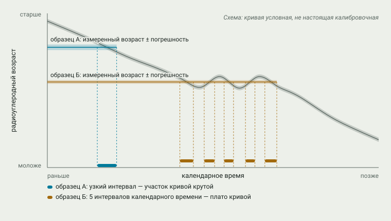

# Главы

Главы идут в причинном порядке, а не по племенам: каждая отвечает на вопрос
«почему вышло так», и следующая опирается на вывод предыдущей.

| № | Глава | Опорный тезис | Статус |
|---|---|---|---|
| 0 | [Как это знают: источники и их пределы](00-metodika.md) | методика | принято |
| 1 | [Заселение: Берингия и волны миграций](01-zaselenie.md) | 1 | принято |
| 2 | [Очаги земледелия](02-zemledelie.md) | 2 | принято |
| 3 | [Сложные общества и цепочки посредников](03-slozhnye-obshchestva.md) | 2 | принято |
| 4 | [Переходная зона: север Мексики и юго-запад США](04-perehodnaya-zona.md) | 2, 6 | черновик |
| 5 | [Эпидемии](05-epidemii.md) | 3 | план |
| 6 | [Удар по центру](06-udar-po-centru.md) | 6 | план |
| 7 | [Лошадь и ружьё](07-loshad-i-ruzhyo.md) | 4 | план |
| 8 | [Эпоха баланса (1650–1815)](08-epoha-balansa.md) | 5 | план |
| 9 | [Переселение и договоры (1815–1860)](09-pereselenie.md) | 5 → 7 | план |
| 10 | [Синхронный финал (1875–1885)](10-sinhronnyj-final.md) | 7 | план |
| 11 | [Ассимиляция](11-assimilyaciya.md) | 8 | план |
| 12 | [Возвращение через право](12-vozvrashchenie.md) | 8 | план |
| 13 | [Сквозные механизмы](13-skvoznye-mehanizmy.md) | все | план |

Статусы: **план** — только тезис, вопросы и источники; **черновик** — проза
и иллюстрации есть, владелец ещё не принял главу; **принято** — владелец
принял главу, она опубликована на [сайте](https://wesaix.github.io/abya-yala/),
но ссылки ещё сверяются; **готово** — все ссылки сверены с источниками.
Планы и черновики видны только здесь, на GitHub.

## Для кого

Главы пишутся для любого читателя — гуманитария и инженера, специалиста и
новичка. Поэтому в них нет аналогий из IT и других узких областей: примеры
берутся из самой темы или из опыта, общего почти для всех. Термины
объясняются при первом появлении простыми словами, а первое упоминание
термина — ссылка на его статью в [глоссарии](../glossary.md); на сайте по ней
всплывает краткое определение.

## Как размечен текст

Каждое утверждение в главе относится к одному из трёх видов.

**Факт** — то, что установлено и не оспаривается в академической литературе.
Пишется обычной прозой со сноской на источник:

```markdown
Восстание пуэбло 1680 г. на двенадцать лет изгнало испанцев из Нью-Мексико.[^hamalainen2008]
```

**Оценка** — интерпретация, с которой согласны не все: «централизованные
государства оказались уязвимее». Оформляется плашкой с меткой и указанием,
чья это оценка:

```markdown
> [!NOTE]
> **Оценка.** Хямяляйнен называет Команчерию империей; критики возражают, что…[^hamalainen2008]
```

**Гипотеза** — предположение, которое источники пока не подтверждают
надёжно, в том числе гипотезы самого конспекта:

```markdown
> [!IMPORTANT]
> **Гипотеза.** Металлургия Западной Мексики пришла морем из Эквадора…[^hosler1994]
```

Если в чём-то нет уверенности — дата, цифра, атрибуция цитаты, — так и
пишется: «по одним данным… по другим…» или «не удалось проверить».

Сноски — ключи из [библиографии](../sources/BIBLIOGRAPHY.md): `[^ключ]` в тексте
и в конце главы `[^ключ]: Автор, год, страница.`

## Иллюстрации

В каждой главе обязательно есть графические материалы — любые, которые
помогают понять механизм: схемы, диаграммы, графики, карты, таблицы,
ссылки на интерактивные визуализации сайта, репродукции источников.
Без иллюстраций глава остаётся планом.

Свои рисунки генерирует `tools/figures.py` в двух темах; в текст они
вставляются так, чтобы GitHub показывал версию под тему читателя:

```html
<picture>
  <source media="(prefers-color-scheme: dark)" srcset="img/00-radiocarbon-dark.svg">
  
</picture>

**Рис. 0.1.** Подпись. *Схема / Данные / Оценка:* откуда взяты значения.
```

Чужие изображения — только общественное достояние или открытые лицензии, с
автором, источником и лицензией в подписи и записью в библиографии.
Изображения человеческих останков, погребений и священных предметов не
используются.

## Шаблон главы

```markdown
# N. Название

> **Статус:** черновик.

Вводный абзац: какой вопрос решает глава и почему он важен для следующих.

## Раздел — механизм или этап
Связная проза…

## Вывод
Явный вывод: что доказано, что осталось оценкой, что — гипотезой.
Как это ведёт к следующей главе.

## Источники
[^ключ]: …
```

Даты: календарные годы, «до н. э.» для отрицательных. Радиоуглеродные даты —
только калиброванные; если в источнике некалиброванная, это указывается.
Даты до 1500 г. в тексте даются со словом «около» или диапазоном.

Названия народов: самоназвание и устоявшееся русское название при первом
упоминании в главе — «ленапе (делавары)», дальше одно из них. Подробнее —
в [глоссарии](../glossary.md).
